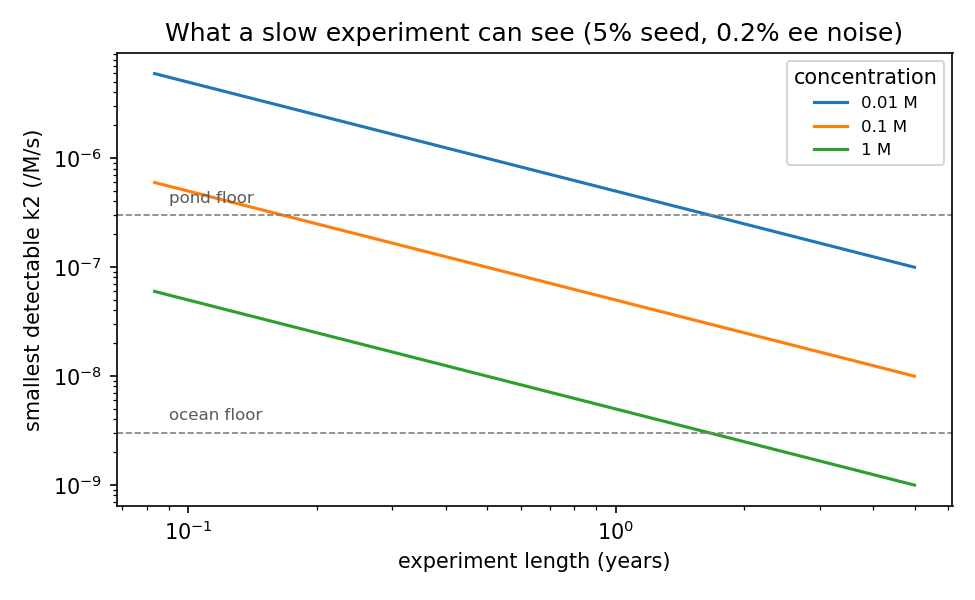

# The slow experiment: searching for self-amplifying handedness at nature's speed

## Aim
Test whether simple early-Earth chemistry in water can **amplify a small excess of one hand**
when given months to years instead of days. The spec sheet (README Part 6) shows that
speed is never the problem for nature, yet lab searches usually stop after days.

## Hypothesis (stated before any data)
At least one prebiotic, water-based peptide-forming system shows **seed-following growth of
enantiomeric excess** (ee) at meteoritic concentrations (≤ 1 mM), with an effective rate k2 ≥ 3×10⁻⁶ /M/s.
That rate is slow enough to be missed by short experiments but fast enough to matter in a 1 mM pond over
100 years (the "pond floor").

*Revised 2026-09-30 after advice from J. Dworkin (NASA Goddard).* The first version ran at 0.1 M with
an assumed 0.2% ee precision. Meteoritic amino acids reach at most a few hundred nmol/g of rock,
which is ≤ ~1 mM in parent-body water. Published ee uncertainties are ±0.01–1.5% (GC-MS) and
1.2–7.2% (LC-MS), and 2.6% from repeat measurements (Glavin & Dworkin 2009).

## Why a *seeded* design
A reaction that only copies itself keeps ee constant, because both hands grow equally. ee *grows*
only if the hands also **suppress each other**. So watching ee grow from a small seed tests
self-copying and mutual suppression together (spec R1 + R2), which is exactly the missing
combination. Seeding is also far faster than waiting for symmetry to break from pure 50/50.
From 50/50, noise in a 50 µL, 1 M vial would need about 18 e-foldings of growth to become visible, versus
under 1 from a 5% seed.

## How long and how concentrated (`design.py`, `review.py` R5)
Smallest detectable rate (/M/s) with a **20% seed**, similar to the largest isovaline excesses in
Murchison. Each time point is measured 9 times, so the noise is σ/3:

| concentration | ee noise per measurement | 1 month | 6 months | 1 year | 3 years |
|---|---|---|---|---|---|
| **1 mM (realistic)** | 2.6% | 6×10⁻⁵ | 1×10⁻⁵ | 5×10⁻⁶ | **2×10⁻⁶** ✓ pond |
| 1 mM | 1% | 3×10⁻⁵ | 4×10⁻⁶ | 2×10⁻⁶ ✓ | 7×10⁻⁷ |
| 10 mM (accelerated) | 2.6% | 6×10⁻⁶ | 1×10⁻⁶ | 5×10⁻⁷ | 2×10⁻⁷ |
| 0.1 M (accelerated) | 2.6% | 6×10⁻⁷ | 1×10⁻⁷ | 5×10⁻⁸ | 2×10⁻⁸ |

Nature's floors at realistic concentrations: **pond 3×10⁻⁶** (1 mM, 100 yr); **ocean 3×10⁻⁹**
(1 µM, 10⁸ yr). No lab run can reach the ocean floor at natural concentration.

**Choice: two tiers.**
1. **Realistic arm:** 1 mM, 20% seed, 3 years, 9 independent vials per condition. Reaches
   1.8×10⁻⁶, below the pond floor (3 vials would reach 2.9×10⁻⁶, only 8% below it). This asks directly whether amplification happens at meteoritic
   concentrations.
2. **Accelerated arm:** 10 mM and 0.1 M for 1 year. These are **not natural conditions**. The arm exists
   to find any amplifier at all and to measure how the rate of ee growth scales with concentration
   (the rate law). The model needs that scaling to extrapolate to 1 µM. If ee grows faster at 0.1 M than
   at 10 mM by exactly 10×, k2 is a true second-order constant and the extrapolation is fair.

## Arms (chemistries to test)
Chosen from the scorecard for prebiotic inputs (R4) and biological products (R7):

| arm | system | why | source |
|---|---|---|---|
| A | amino acids + carbonyl sulfide (volcanic gas) → peptides, in water | prebiotic peptide formation; peptides can prefer same-hand partners | Leman, Orgel & Ghadiri 2004 |
| B | amino acids + hydroxy acids, **wet-dry cycling** (e.g. daily) | pond-like driving; makes polypeptides | Forsythe et al. 2015 |
| C | prebiotic cysteine peptides that **catalyse peptide joining** in neutral water | the closest known thing to self-copying in prebiotic water | Foden et al. 2020 |
| D | RNA precursor (RAO) on **magnetite**, then crystallization | non-autocatalytic route that already breaks symmetry | Ozturk et al. 2023 |
| E | peptide-catalysed **transamination** (pyruvate + pyridoxamine → alanine) coupled to **peptide ligation**, run **fed (slow flow)** | a proposed prebiotic network predicted (in a model) to break symmetry on its own, built from two reactions studied in the lab; the model says it must be fed, not closed (`review.py` R6) | Yu et al. 2024; Deng, Yu & Blackmond 2024; Higgs & Blackmond 2025 |
| + | **Positive control:** Viedma grinding of a known conglomerate | proves the pipeline detects real amplification | Viedma 2005 |

Arms E and C are the priority. E is a prebiotic network with a published model prediction that it may break symmetry on its own (Higgs & Blackmond 2025). Its transamination step has been run in the lab but its rate is not yet pinned down: Yu et al. 2024 Table 2 reports % conversions for the *reverse* reaction (alanine + pyridoxal → pyruvate + pyridoxamine), which imply rough second-order rates of 6×10⁻⁶–1×10⁻⁴ /M/s depending on the peptide catalyst (our estimate, not a measured rate constant). That is a conversion rate, not the amplification rate k2 in the table above, so it does not show that E's amplification would be detectable; measuring k2 is the point of the arm. *(Corrected 2026-10-01: earlier text called E "the only" such network and said its step "has a measured rate near 10⁻⁴ /M/s … well above the 1-year detection floor"; the 10⁻⁴ came from the reverse reaction and the floor applies to k2, not to conversion.)* Run E in a slowly fed vessel; a closed vial is predicted to return to 50/50. C is the only other catalytic loop in prebiotic water.

## Conditions per arm
For each arm, three seeds × 9 independent vials (realistic arm; 3 suffice for the accelerated arm):
- **+20% L seed**
- **+20% D seed** (the mirror control, the most important control)
- **0% (racemic)**

Plus three negative controls (3 vials each): no activator / no cycling; sterile-filtered;
and the seed amino acid alone (to measure plain racemization).
That's 27 + 9 = 36 vials per realistic arm (9 + 9 = 18 per accelerated arm), plus the positive control. Temperature 25 °C, with an optional
40 °C set to speed things up. Racemization is then negligible over a year for most amino
acids, and the "seed alone" vials measure it directly.

## Sampling
Days 0, 3, 7, 14, 30, 60, 90, 120, 180, 270, 365, then every 6 months to 3 years for the realistic arm (roughly evenly spaced on a log scale). Each vial is injected in triplicate; injections are averaged, not counted as replicates.
Measure ee of the monomers (and of short peptides where possible) by **chiral GC-MS or HPLC**
on derivatized samples. Keep analysts **blind** to vial labels.

## Decision rule (fixed in advance)
Call an arm an **amplifier** only if **all four** hold:
1. |ee| rises by > 3.7% absolute over its start in both seeded sets (3√2 × 2.6%/√9). Use a smaller threshold if the lab's measured precision is better.
2. The **L-seeded and D-seeded vials change by equal and opposite amounts** (within noise).
3. The racemic vials stay at 0 within noise.
4. Sterile and no-activator controls show no change.

Then fit `ee(t) = e0·exp(k·t)` to get k, and k2 = k / c. Compare k2 with the floors
(3×10⁻⁶ pond at 1 mM, 3×10⁻⁹ ocean at 1 µM), using the accelerated arm's rate law to extrapolate.

## The eight tests for a credible excess (Dworkin et al. 2024)
Dworkin et al. (2024) list eight tests that a reported ee should pass, and say that any test not passed should be explained. How this plan handles each:

| test | what it asks | how this plan meets it |
|---|---|---|
| 1 Blanks | lab blanks shown | sterile-filtered and no-activator controls (Conditions); **to add:** a procedural blank (no amino acid) at every time point, not yet in Conditions |
| 2 Isomers | all structural isomers accounted for | defined starting materials, so the possible isomers are known; run standards of every enantiomer the chemistry can make (including peptides measured as monomers) |
| 3 Co-elution | no unrelated compound under the peak | confirm each peak by mass spectrum, and on a second column or derivatization; the racemic vials show where a peak sits when nothing has changed |
| 4 Isotopes | δ¹³C of each enantiomer, separately | **does not apply in the usual form**: there is no terrestrial-vs-extraterrestrial question in a lab synthesis. Optional: a ¹³C-labelled seed in one replicate set would show whether new ee comes from the seed or from the feedstock |
| 5 Errors | statistics from separate replicates, not repeat integrations of one run | **resolved:** the realistic arm uses 9 independent vials per seed condition, so the noise is σ/3 and the arm reaches 1.8×10⁻⁶ (`review.py` R5). With 3 vials it would reach 2.9×10⁻⁶, only 8% below the pond floor. Repeat injections of one vial do not capture vial-to-vial scatter and are averaged, not counted. Report the number of vials and of injections separately |
| 6 History | contamination sources and sample history | biology adds L, so the D-seeded mirror arm is the key check; sealed vials, a chain-of-custody log, and blind analysts |
| 7 Context | ee consistent with the rest of the sample | an excess must come with matching chemistry: products form, the yield is sensible, and the excess appears only in the arms that make them; the racemic set staying at 0 is the internal positive and negative check |
| 8 Multiple examples | same result in several samples or labs | nine independent vials per seed condition, the mirror arm, and the Viedma positive control; any amplifier found should be re-run in a second lab before it is claimed |

## Contamination: the main way this goes wrong
Biology is left-handed, so any microbe, skin trace or reagent impurity adds **L**.
That would look like "amplification" in the L-seeded vials. Safeguards:
- **The D-seed mirror arm:** real amplification is symmetric; contamination pushes both sets toward L.
- Sterile filtration, sealed vials, and a vial with no amino acid (it should show zero amino acids).
- If only the L arm "amplifies", report it as contamination, not a result.

## What each outcome means
| result | meaning for the project |
|---|---|
| An arm amplifies at k2 ≥ pond floor | First prebiotic, water-based amplifier; pond seeding by meteorites becomes a complete story |
| An arm amplifies but slower than the floor | Real, but too slow to matter in a pond; ocean-scale only |
| Nothing amplifies at 1 mM in 3 years, or at 0.1 M in 1 year | Rules out these chemistries down to k2 ≈ 2×10⁻⁶ (realistic) or 5×10⁻⁸ (accelerated). That's still a publishable upper limit, and it tightens the spec |
| Only the positive control amplifies | Pipeline works; the gap in the scorecard is real |

## Limits and practical notes
- This needs a chemistry lab with chiral GC-MS or HPLC. It's a proposal for a mentor or a summer lab, not a home experiment.
  Local groups with chiral GC-MS (suggested by J. Dworkin): NASA Ames (G. Cooper, G. Chaban); San José State (A. Rios).
  Carbonyl sulfide is a toxic gas and needs fume-hood handling (arm A).
- The 2.6% noise figure comes from published repeat measurements. The lab's own precision sets the
  real threshold; the smallest detectable k2 grows roughly in proportion to the noise.
- A null result limits only these specific chemistries, not all possible ones.
- The rate model is the single-exponential early phase from `sim.py`. Late saturation isn't used for the fit.

## References
- Leman, Orgel & Ghadiri 2004, *Science*, doi:10.1126/science.1102722
- Forsythe et al. 2015, *Angew. Chem.*, doi:10.1002/anie.201503792
- Foden et al. 2020, *Science*, doi:10.1126/science.abd5680
- Ozturk et al. 2023, *Sci. Adv.*, doi:10.1126/sciadv.adg8274
- Yu, Darù, Deng et al. 2024, *PNAS* 121:e2315447121, doi:10.1073/pnas.2315447121
- Deng, Yu & Blackmond 2024, *Nature* 626:1019, doi:10.1038/s41586-024-07059-y
- Higgs & Blackmond 2025, *PNAS* 122:e2423683122, doi:10.1073/pnas.2423683122
- Viedma 2005, *PRL* 94:065504, doi:10.1103/PhysRevLett.94.065504
- Dworkin, Elsila, Glavin, Aponte, McLain, Simkus, Graham & Parker 2024, "Verification of chiral asymmetry in meteoritic organics", 55th LPSC, Abstract #2645
- Frank 1953, *Biochim. Biophys. Acta* 11:459
- Glavin & Dworkin 2009, *PNAS* 106:5487, doi:10.1073/pnas.0811618106
