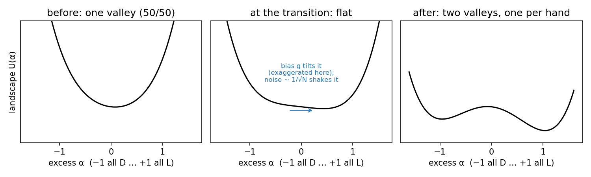

# Could the weak force pick life's hand in an icy-moon ocean?

**DRAFT — not submitted; for student + mentor review; every number traces to README.md or EXPERIMENT.md**

## Abstract

Life uses left-handed amino acids and right-handed sugars, and no one knows why. One old idea (Kondepudi & Nelson 1985) is that the weak nuclear force makes one hand very slightly lower in energy (the parity-violating energy difference, PVED), and that a large, slow, self-amplifying chemical system could turn that tiny bias into a one-handed outcome. We ask when the bias beats random chance, using stochastic simulations checked against a formula, and apply the answer to the subsurface oceans of Enceladus and Europa and to early Earth's ocean.

A rule of thumb comes out (§3.0): about 10³³–10³⁴ molecules, a few billion moles, must take part in the decision *together*. That means kilometre-scale volumes of well-mixed water at micromolar to millimolar concentrations. Ponds and single rock pores are many orders of magnitude too small. Icy-moon oceans are big enough, so the answer turns on how well they mix. Their salinity sets how strongly they are stratified, and a stratified ocean mixes slowly up and down. The patchwork of hands then freezes into stacked layers that merge only as fast as vertical mixing allows (§3.3; pictures in Fig. 2). Varying every uncertain input at once, physics wins in 22% (Enceladus), 29% (Europa) and 75% (early Earth) of plausible cases (§3.9).

The racemic amino acids in samples returned from asteroid Bennu, plausibly a fragment of a wet parent body, are a strong test (§3.10). Every amplifier in our assumed rate range would also have finished on Bennu's parent body and left large, measurable excesses there. If the same chemistry ran in both places, only slower amplifiers are allowed, and physics then wins in just 2% (Enceladus), 4% (Europa) and 15% (early Earth) of cases. Connected compartments, such as the pores of a vent mound, help only in proportion to the volume they connect within the decision time (§3.11). Long runs show no late drift or flipping at realistic molecule numbers (§3.12). No known prebiotic reaction amplifies handedness this way, so we pre-register a wet-lab search sized for meteoritic concentrations (≤1 mM) and published measurement precision (§5). All code is public and self-checking (§6).

## 1 Introduction

Almost all life uses left-handed ("L") amino acids in proteins and right-handed ("D") sugars in DNA/RNA, even though both mirror-image forms are chemically identical alone. One idea, from Kondepudi & Nelson (1985), is that the weak force makes left- and right-handed molecules very slightly different in energy (PVED). That bias is astronomically small, but a large enough, slow enough, self-amplifying chemical system (each hand helps make more of itself while suppressing the other) could in principle let it beat chance.

No one had applied this size-and-time test to icy-moon oceans before this project; a scan of all 435 papers citing Kondepudi & Nelson 1985 (the paper that proposed the idea) or Brandenburg & Multamäki 2004 (closest prior spatial work, no weak force) found none that do (README, Novelty check). The question: is an icy-moon or early-Earth ocean large and mixed enough for the weak-force bias to reliably beat chance, or is the outcome decided by luck? This is a student computational project. Every number below is either produced and self-checked by a script in the project folder, or a cited literature number (flagged where used), with the source README "Part" noted in brackets.

## 2 Methods

### 2.1 The core model (`sim.py`)

Let α = (L − D)/(L + D) be the excess of one hand. Near the point where a self-amplifying reaction "switches on", any such reaction reduces to the same simple equation (the normal form; Fig. 1):

$$d\alpha = \left(\lambda(t)\,\alpha - \alpha^3 + g\right)dt + \sqrt{\varepsilon}\,dW, \qquad \lambda = \gamma t .$$

- λ is how far past the switch-on point the system is. Before it (λ < 0) the only stable state is 50/50; after it (λ > 0) there are two stable states, all-L and all-D.
- g = ΔE_pv / kT is the weak-force bias (ΔE_pv is the PVED per molecule; its sign for real amino acids is unsettled).
- ε ≈ 1/N is the noise from counting individual molecules, N being the number of molecules that react together.
- γ = 1/(kτ) is how quickly conditions sweep through the switch-on point, where k = k₂c is the self-copying rate (rate constant k₂ times concentration c) and τ is the time the sweep takes. Time is measured in units of 1/k.

Linearising around λ = 0 gives the chance that the weak-force-favoured hand wins:

$$P = \Phi(\Delta), \qquad \Delta = \sqrt{2}\,\pi^{1/4}\, g\, \gamma^{-1/4}\, \varepsilon^{-1/2} = \sqrt{2}\,\pi^{1/4}\, g\,(k\tau)^{1/4}\sqrt{N},$$

where Φ is the normal cumulative distribution. Δ = 2 means a 97.7% win. The formula is checked against 4,000 brute-force runs per point (agreement ±0.005, Part 1).



### 2.2 Oceans (`ocean.py`, `scenarios.py`, `uncertainty.py`)

For a body of water, N = c · V · f · 1000 · N_A, where V is the volume (m³), f the fraction that is well mixed on the decision time, and N_A Avogadro's number. Physics "wins" only if two conditions both hold: the size condition Δ ≥ 2, and the time condition k₂cτ ≥ 10 (the reaction actually finishes). `uncertainty.py` draws 200,000 input sets per world, log-uniform over each plausible range: bias g, rate k₂, concentration c, horizontal and vertical mixing, time, volume, and the real-chemistry factor F (§2.4).

### 2.3 Space and mixing (`domains.py`, `domains3d.py`, `coarsen3d.py`, `k3.py`, `shell3d.py`, `aniso3d.py`, `sphere_layers.py`)

With mixing, α becomes a field α(x, t):

$$\partial_t \alpha = \lambda\alpha - \alpha^3 + g + D_h\nabla_h^2\alpha + D_z\,\partial_z^2\alpha + \text{noise}.$$

D_h and D_z are the horizontal and vertical eddy diffusivities. Rescaling depth by √(D_h/D_z) turns this exactly into the equal-mixing equation in a box that is taller by that factor. So weak vertical mixing acts like a deep, narrow ocean. After the decision, walls between regions of opposite hand move at D × curvature (Allen & Cahn 1979). Closed patches shrink, so patch size grows as l = A√(Dt), and the majority hand takes over (Fig. 2). Flat walls between horizontal layers do not move.

**Numerical scheme.** All spatial runs use explicit Euler (Euler–Maruyama when noise is included), which is first order in time, together with second-order centred differences (the 7-point Laplacian) in space. Walls are periodic sideways; top and bottom are closed (no flux). Units are 1/k for time and √(D/k) for length, with grid spacing 1 and time step 0.05. That satisfies the 3D stability limit D·dt/dx² ≤ 1/6. The resolution and time-step checks are in §3.12.

### 2.4 Real chemistry (`frank.py`, `frank2.py`)

The normal form is checked against a full Frank-type network in a flow reactor. Here A is the achiral feedstock (for example an amino-acid precursor), and L and D are the two hands of the product:

| reaction | rate | role |
|---|---|---|
| feed → A | f(a₀ − a), a₀ ramped slowly upward | supply; the ramp sweeps the system through switch-on |
| A → L, A → D | k₀a each | slow uncatalysed production (unbiased) |
| A + L → 2L | k(1 + g)aL | self-copying; the weak force enters as ±g |
| A + D → 2D | k(1 − g)aD | |
| L + D → waste | k_i LD | mutual destruction ("cross-inhibition") |
| L, D → out | k_d L, k_d D | outflow |

The two ingredients that make it amplify are self-copying and mutual destruction. Every reaction is simulated with its own counting noise (the chemical Langevin equation). At the switch-on point the network maps onto the normal form: g_eff = 2gxka, ε = (2k₀a + 2x(ka + k_d))/Ω, and γ = k·da/dt, where x is the concentration of each hand and Ω the reactor size. The extra noise from non-copying reactions lowers Δ by a factor F ≈ 0.7 compared with §2.2. `frank2.py` adds reverse reactions as a second scheme.

### 2.5 Other scripts

- `inherit.py`: a pool that inherits a small excess (Part 4b).
- `dual.py`: coupled amino-acid and sugar systems (Part 5).
- `scorecard.py`: real reactions scored against seven requirements (Part 6).
- `design.py`: experiment sizing (§5).
- `review.py`: the checks added after expert feedback (§3.0, §3.10–3.12, §5).
- `coarsen_fig.py`, `sketch.py`: the figures.
- `shell_res.py`: the grid-resolution test.

Every script asserts its own checks.

## 3 Results

### 3.0 A common-sense rule: how many molecules must decide together? (`review.py` R1)

Setting Δ = 2 in the formula gives the number of molecules that must react as one well-mixed pool: $N \ge \left(2 / (\sqrt{2}\,\pi^{1/4} g\,(k\tau)^{1/4})\right)^2$. For g = 10⁻¹⁷ (the middle of the modern PVED range) and a reaction that only just finishes (kτ = 10), N ≥ 3.6×10³³ molecules, or 6×10⁹ mol. At 1 µM that is a well-mixed cube of water 18 km on a side; at 1 mM, 1.8 km; at 0.1 M, 0.4 km. A 1 m³ pond at 1 M holds only 6×10²⁶ molecules, about 7 orders of magnitude too few.

The PVED is a fixed energy, so the bias g = ΔE/kT is larger in the cold. The needed N scales as T²: 3.6×10³³ at 0 °C, 4.3×10³³ at 27 °C, 6.7×10³³ at 100 °C. Cold helps only by a factor of about 2. Time helps only weakly, as $(k\tau)^{1/4}$: a sweep 10,000× slower lowers N by 100×. The practical message is that concentration alone cannot rescue a small setting. Only ocean-scale water that is mixed within the decision time can pool enough molecules.

### 3.1 Is an icy-moon ocean big enough? (Part 1)

At a representative bias g = 1e-17 and rate k2 = 1e-3 /M/s, the minimum reactant concentration needed for physics to win is ~2 mM for a small lake, but only ~50 pM for Enceladus, ~4 pM for Earth, and ~1 pM for Europa. Size is not the limit for icy-moon oceans across the modern PVED range. Time becomes the limit when chemistry is slow: at k2 = 1e-6 /M/s the time condition sets the answer for every ocean (~3 nM for Enceladus); temperature jitter barely matters, shifting the win probability by <0.01. If only a fraction f of the ocean is well mixed, the effective bias scales as g·√f — 1% mixing on Enceladus behaves like a bias ten times smaller.

### 3.2 One ocean, or a patchwork? (Part 2)

Adding 1D spatial mixing, three laws were derived and checked to a few percent. A single ocean-wide outcome needs D ≥ 3×10⁻⁶ m²/s (Enceladus) or 1×10⁻⁵ m²/s (Europa). Molecular diffusion (~10⁻⁹ m²/s) is far too slow for either, but the mixing rate modeled by Zeng & Jansen (2021), 5×10⁻⁵ m²/s, clears both. With only diffusion, oceans fragment into km-scale patches and the favoured hand gets just 50–58% of Enceladus (up to 79% of Europa at 1 µM) — a mostly chance-decided, mixed-hand ocean; with modelled mixing, physics wins ocean-wide down to ~1 nM (Enceladus) or ~1 pM (Europa).

### 3.3 The 3D correction — patches heal themselves (Part 3)

In full 3D, the 1D patch-size law fails (31% spread). Curved 3D patch walls straighten themselves out, so small patches shrink even with no bias: size grows as `l = A·√(D·t)`, exponents 0.45/0.49 (theory 0.5), A = 5.48/5.60 at two mixing strengths (a 2026-09-23 correction fixed a rounded "5.5 at both"; conclusion unchanged). Starting from a 55% majority, it grows to 66% (t=50), 81% (t=200), 93% (t=400) — standard phase-ordering physics. Healing within the moon's age needs D ≥ 6×10⁻⁶ m²/s (Enceladus) or 2×10⁻⁵ m²/s (Europa); diffusion alone would take 6×10¹¹–2×10¹³ years, modelled mixing heals in ~1×10⁷ (Enceladus) or ~4×10⁸ years (Europa). *Correction (2026-09-25):* the thresholds above apply one mixing value over the ocean's width, and the 10⁻¹⁰–10⁻³ m²/s range (and the 5×10⁻⁵ "modelled" value) are Zeng & Jansen's **vertical** diffusivity (their Sec. II.2). Treating the directions separately: sideways healing needs only ≥ ~6×10⁻⁴ (Enceladus) or ~2×10⁻⁴ m²/s (Europa), about 180–450× below the ~0.1 m²/s sideways eddy mixing estimated by Zhang, Kang & Marshall (2024) (50–140× below 0.03, the low end of their runs), so it never limits. Healing over the depth (≈40 km Enceladus, ≈120 km Europa) needs vertical mixing ≥ ~2×10⁻⁹–2×10⁻⁶ m²/s (Enceladus) or ~4×10⁻⁹–2×10⁻⁷ m²/s (Europa), which still sits inside the vertical range: *Update (same day, `aniso3d.py`):* that top-to-bottom rule is the wrong picture for most of the range. Weak vertical mixing is exactly equivalent to equal mixing in a taller ocean (stretch depth by √(D_h/D_z)); the stretched ocean is deeper than wide for 92–96% of the plausible range. In such tall boxes the patchwork froze into 3–5 stacked layers in 7/8 runs (unchanged from t = 500 to 1000), while a cube healed to one hand in 4/4 runs from a 55% start. On a round moon, layer boundaries are spheres: a wavy boundary was measured to flatten at D_h·k² regardless of D_z (0.00967 vs 0.00964 and 0.00239 vs 0.00241), which holds in a flat box. *Correction (2026-09-26):* on a sphere "down" follows the radius, so a constant-depth boundary feels only vertical mixing and sinks at 2·D_z/R, not 2D_h/R as first written (which gave takeover within ≤1.5×10⁴ yr Enceladus, ≤2.8×10⁵ yr Europa). `sphere_layers.py` measured sink speeds of 0.991/0.991/0.984 × 2·D_z/r with 0.0% change when D_h ×4; takeover now takes up to 1.5×10¹² yr (Enceladus) or 2.8×10¹³ yr (Europa) at D_z = 10⁻¹⁰ m²/s, and the merge-in-time condition holds in 33%/34% of draws (MEASURED). The hemisphere split is still unstable (rate 1.017× predicted; an off-equator band vanished), because of a shift off the great circle (a tilt is just a rotation, so cannot matter). The top layer decides with its own molecules (a share L/H' = 0.25 of the ocean, ASSUMED; a column-like sphere run measured 0.52 and 0.07 in 2 runs, neither supporting nor ruling it out); the favoured hand ended on top in 3/4 runs from 55% vs 2/4 from 50% (MEASURED, small sample). A direct per-patch check (`k3.py`) found an effective decision volume of 60.2 cells, consistent to 1% across three bias strengths (a correction fixed a rounded "≈57 cells"). Three more seeds gave K3 = 3.698, 3.481, 3.652 (original 3.642), a 2.3% spread across all four (MEASURED). Fig. 2 shows both behaviours: a cube healing to the majority, and a tall (weakly mixed) box freezing into layers that do not change from t = 400 to t = 5000.


For early Earth (1.33×10¹⁸ m³, mean depth 3.7 km), a one-ocean outcome needs D ≥ 5×10⁻⁴–2×10⁻² m²/s — cleared by horizontal eddies (~10³ m²/s, Abernathey & Marshall 2013) and even by vertical mixing alone (1.1×10⁻⁵ m²/s, Ledwell et al. 1993: 94% win at 1 nM, 100% at 1 µM). Earth's own left-handedness can't confirm any of this, though — all life shares one ancestor, so any mechanism (chance included) ends with one hand; a second, independent ocean (Enceladus, Europa) is the real test.

### 3.4 Where was the hand decided? (Part 4)

Open ocean gives physics ~100% odds; lake/lagoon 51–100%; warm little pond 50–52% (coin flip); vent pore 50% (coin flip). The tension: settings chemists favour for concentrating molecules (ponds, vent pores) are exactly where physics loses, since they hold too few molecules total. The concentration inputs are the weakest part of this: Stribling & Miller (1987)'s ~3×10⁻⁴ M early-ocean amino-acid estimate is the only sourced number, with no lower estimate found in the literature — treat it as contested, not consensus.

### 3.5 Can small pools inherit a hand? (Part 4b)

A pool that fills with water already carrying a small excess can reliably follow it above a threshold, checked against 4,000 runs/case across 5 cases. Required inherited excess: 3×10⁻¹⁴ (lake/lagoon), 6×10⁻¹² (pond), 1×10⁻⁶ (vent pore). The weak force alone supplies only ~5×10⁻¹⁸ at equilibrium — far too small — but an ocean that already amplified the bias can supply up to ~1, and meteorites (Murchison L-isovaline, Glavin & Dworkin 2009, 18.5% excess) supply enough by 5–13 orders of magnitude. This made meteorite seeding look like the simplest explanation, though isovaline is not itself a protein amino acid and its excess would need catalytic pass-through (shown for isovaline → D-sugar, Pizzarello & Weber 2004). *Update:* samples returned from Bennu contain chiral non-protein amino acids that are racemic or nearly so (Glavin et al. 2025), and Ryugu's are also racemic (Furusho et al. 2024). The Bennu authors conclude that delivered molecules may not explain life's handedness. So meteoritic excesses are not universal; they vary with parent-body history (Elsila et al. 2016; Glavin et al. 2020). One caveat is that the excess a pond needs (6×10⁻¹²) is some 10 orders of magnitude below what any lab can measure (about ±1%). "Racemic within error" therefore neither supplies nor rules out a pond-sized seed.

### 3.6 Why L-amino acids pair with D-sugars (Part 5)

Two coupled chiral systems, each helping the partner's hand, were checked against 4,000 runs/case. Real chemistry links them both ways: L-amino acids catalyse D-sugar excess (Pizzarello & Weber 2004; Breslow & Cheng 2010); D-RNA prefers L-amino acids ~4× (Tamura & Schimmel 2004). Without coupling the hands match only 50% of the time; with κ ≈ √γ, 99.9%. The winning pair depends on the *sum* of the two biases — predicted/simulated probabilities of L-amino-acid + D-sugar ranged from 0.500 (biases cancel) to 0.800 (biases add) across four tested combinations. Coupling means physics only makes one combined decision — but the sugar PVED sign is unsettled, and if it actually favours L-sugars (opposite natural D), the biases would partly cancel, pushing back toward a coin flip. A 2005 whole-DNA-helix calculation (Faglioni et al.) concluded the weak force does *not* favour nature's helices, per its abstract. "Not the natural helix" is weaker than a strong push toward the mirror helix; the full paper was inaccessible (paywalled), so this is checked against the abstract only.

### 3.7 The missing reaction (Part 6)

Seven requirements for a self-amplifying prebiotic chiral reaction were derived (self-copying; mutual suppression; driven away from 50/50; works in water from simple molecules; fast enough; works from a tiny excess; biologically relevant product). Scoring seven real candidates, the best (Noorduin 2008 attrition deracemization) scores 6.0/7, but **no known system meets self-copying + suppression + prebiotic plausibility + relevant product together.** Speed is never the limiting factor — natural chemistry has 10⁵–10⁸ years, so even extremely slow reactions qualify. This gap motivates the wet-lab experiment in Section 5.

### 3.8 Does real chemistry follow the formula? (Part 7)

The network (§2.4, table) is the classic Frank (1953) scheme: an achiral feedstock A turns into L or D, each hand copies itself from A, and the two hands destroy each other on contact. Self-copying makes whichever hand leads grow faster, and mutual destruction removes the minority. Together they turn a small lead into a one-handed outcome. The network, simulated with molecular counting noise from every reaction step, follows the simplified formula within ~1 percentage point in the slow (natural) limit (2.5 points near saturation); a fast sweep selects *more* strongly than predicted, so the formula is conservative. The real network's selection strength is lower by a conversion factor F ≈ 0.7, because every reaction adding/removing a chiral molecule adds noise, not just self-copying ones — so every concentration in Parts 1–4 should rise by about 1.6×. No conclusion changes, since margins there were 10×–10⁶×, except the Europa mixing margin (not concentration-based).

### 3.9 Robustness checks (Part 8)

Varying every uncertain input at once (200,000 draws/world), physics wins in **75%** of plausible cases for early Earth's open ocean, **22%** for Enceladus and **29%** for Europa on a round moon (3% and 7% if layers never merged); the merge-in-time condition holds in 33%/34% of draws. Vertical mixing is the most decisive input (0%/0%/52% win rate in the low half of its range vs. 43%/57%/97% in the high half, Enceladus/Europa/Earth); concentration (+21/+10) and time (+15/+11; +32 for Earth) come next, then bias g (+8/+4) and rate k2 (+5); faster sideways mixing lowers the rate slightly (−2 to −9); F and volume ≤2 for the moons. *(Corrections 2026-09-25: first reported as 18% for both moons, from a run that used the vertical-mixing range for sideways healing; then 43%/58% before layering was modelled. Correction 2026-09-26: then 100%/55%/78% with concentration deciding (21%/57% vs. 89%/99%), bias g +18 to +23, k2 +14, vertical mixing +10 to +14, from a run that let layer boundaries sink at 2·D_h/R instead of 2·D_z/R.)* A second reaction scheme with back-reactions matches the formula within 1.7 points and gives F = 0.71 (vs. 0.70). A thin, wide "shell" shape closer to a real ocean's proportions still shows the majority taking over, just more slowly (growth exponent 0.41 vs. 0.45–0.49 in a cube).

### 3.10 Reconciling the model with racemic Bennu and Ryugu (`review.py` R2)

Bennu is plausibly a fragment of a wet parent body. Its chiral amino acids, including isovaline, which cannot racemize after it forms, are racemic or nearly so (Glavin et al. 2025). This is a direct test of the model, because the model assumes that some amplifying chemistry exists. The inputs below are ASSUMED ranges: amino acids at 10–330 nmol/g of rock (330 nmol/g is the highest value for LAP 02342, from J. Dworkin, pers. comm.), a water-to-rock mass ratio of 0.1–1 (giving 10⁻⁵ to 3×10⁻³ M in the fluid), and aqueous alteration lasting 1–10 Myr. Then c·τ on Bennu's parent body was 3×10⁸ to 9×10¹¹ M·s. Any amplifier with k₂ ≥ 10⁻¹¹ to 3×10⁻⁸ /M/s would have finished there. With only pore-water diffusion, the finished patches would be 1–3 km across, so each gram-sized sample would sit inside one patch and show a large excess of one hand or the other. The racemic samples say no such amplifier finished there.

Suppose the same chemistry, with the same rate constant, operated on Bennu's parent body and in the icy-moon oceans:

- **Rates in the original range (10⁻⁶ to 1 /M/s):** every draw would have finished on Bennu. Taken at face value, Bennu rules out the whole range.
- **Rates extended down to 10⁻¹² /M/s:** 23% of draws keep Bennu racemic. Among those, physics wins in only **2% (Enceladus), 4% (Europa) and 15% (early Earth)** of cases. An amplifier slow enough to stay idle on Bennu is usually too slow to finish in an icy moon as well. Only 1–5% of icy-moon draws have a larger c·τ than Bennu's maximum.

This is the strongest constraint in the paper. The escape routes all say that the chemistry differed:

- the amplifier needed something Bennu's fluid lacked (longer peptides, mineral surfaces, warmer or longer-lived water);
- Bennu's water was mostly pore water in mud, not a free ocean;
- the amino-acid concentration in Bennu's fluid is not the concentration of the amplifier's reactants.

Each escape route is testable, but none is shown here. Temperature differences between the two settings are not modelled.

### 3.11 Compartments: can a network of connected pools beat one pond? (`review.py` R3)

Several authors suggest that life began in connected compartments, such as the pores of a hydrothermal mound (Milner-White & Russell 2005; Russell, *Scientific American*), acting together as one "reactor". We simulated 16 compartments, each with 1/16 of the molecules, exchanging material at rate q (normal form, g = 10⁻³, γ = 0.01):

| exchange rate q × decision time | P(majority favoured) | runs ending all one hand |
|---|---|---|
| 0 (isolated) | 0.675 | 0% |
| 0.1 | 0.686 | 0% |
| 1 | 0.724 | 53% |
| 10 | 0.714 | 100% |

A single pool holding all the molecules gives P = 0.724, and one isolated compartment gives 0.559. So compartments that exchange faster than the decision time (√(τ/k)) act as one pool of their combined volume, and afterwards they heal to one hand. Isolated compartments vote by majority but stay a mix of hands forever.

In a real vent mound (k₂ = 10⁻³ /M/s, c = 1 mM, 10⁵ yr), the decision takes about 56 years. Pores 1 mm apart exchange by diffusion 2×10⁶ times faster than that, so they are fully connected. Diffusion reaches only about 1.3 m in 56 years, however, so a diffusion-connected mound behaves like a ~2 m³ pond: P = 0.500, a coin flip. If fluid flow connects a 100 m mound (10⁶ m³), P = 0.73; a flow-connected cubic kilometre gives P = 1.000. Compartments do beat ponds, but only by the volume that fluid flow links together within the decision time. That makes a flowing vent system a serious candidate, consistent with §3.0.

### 3.12 Long runs and numerical resolution (`review.py` R4, `coarsen_fig.py`, `shell_res.py`)

*Does the decided hand drift later?* We continued the sweep with the reaction held at saturation for 100× longer than the decision itself. The share of runs on the favoured hand was 0.730 at the end of the sweep, 0.730 after 10³ more time units, and 0.730 after 10⁴. Once decided, a pool flips only by a rare noise-driven jump. We measured the flip rate at high noise and found it matches Kramers' rate (√2/2π)·e^(−1/2ε) within 5%: 1.8×10⁻², 7.7×10⁻³, 3.4×10⁻³ and 1.4×10⁻³ per unit time at ε = 0.2, 0.15, 0.12 and 0.1. With ε = 1/N the rate falls as e^(−N/2). A 1 µm³ droplet at 1 µM (about 600 molecules) can flip; a pond or ocean never does. The frozen layers in Fig. 2 show no change between t = 400 and t = 5000 (a 12× longer run).

*Grid resolution* (suggested by A. Brandenburg). The thin-shell runs (§3.9) use 8 grid points in depth, and a wall is only about 1.4 cells wide. We reran the same physical box (256 × 256 × 8 units) with grid spacing 1 (256 × 256 × 8 points) and 1/2 (512 × 512 × 16 points), with the time step scaled by dx². A run with grid spacing 1 and a 4× smaller time step gave identical patch sizes (30, 37, 47, 68, 91 at t = 25–400), so the time step is converged. On the fine grid, patch sizes were 31, 39, 48, 64 and 93, within 5% of the coarse grid at every time, and the growth exponent was 0.39 against 0.41. The coarse grid therefore resolves the coarsening, and the 8-point depth does not change the results; this is expected because the scheme is second order in space. We also ran a smaller box (128 × 128 × 8 units) with 2 seeds per case to check majority takeover. The coarse and fine grids agree in direction (a 55% majority grows on both), but runs from exact 50/50 vary too much between seeds to say more (`shell_res.py`).

## 4 Limitations

- All results are order-of-magnitude estimates; the F ≈ 0.7 real-chemistry conversion (Part 7) is checked for only two reaction schemes; other schemes could give a smaller F.
- Part 2's spatial laws are 1D; Part 3's 3D correction uses finite 128³ boxes, and the 55%→93% late-time takeover is shown only qualitatively (patches reach the box edge).
- Real ocean turbulence isn't simple diffusion; icy-moon vertical mixing (Zeng & Jansen 2021) is a model input, uncertain across 10⁻¹⁰–10⁻³ m²/s — the single biggest reason the icy-moon answer isn't settled (Parts 2–3). Sideways mixing (~0.1 m²/s, Zhang et al. 2024) never limits healing. On a round moon layers merge only as fast as vertical mixing allows (checked on a spherical shell, `sphere_layers.py`), so vertical mixing is again the key unknown; the deciding top layer's thickness is an estimate.
- τ (how slowly conditions change) is set to the ocean's age, the most favourable case possible.
- No known prebiotic reaction performs the needed self-amplifying chirality; the Soai reaction does it in the lab but isn't prebiotic; rate k2 is a swept assumption, not measured (Part 6).
- PVED has never been measured directly; its sign for amino acids in water is unsettled (the "conformation problem", 2009), and the sugar PVED sign is also unsettled, with some evidence pointing the "wrong" way, which would partly cancel the amino-acid bias (Part 5).
- The Enceladus ocean volume (2.7×10¹⁶ m³) is derived indirectly from ice-shell/core geometry (Čadek et al. 2016), self-checked by `ocean.py` against that paper's implied range (2.45–2.93×10¹⁶ m³); the ocean's age is separately debated (1 Myr–1 Gyr).
- Physics wins for Enceladus/Europa in 22%/29% of the plausible input range, early Earth 75% (Part 8) — not settled, and it falls to 3%/7% if layers never merge; vertical mixing is the key unknown. *History: first reported as 18%, then 43%/58% (corrected 2026-09-25), then 55%/78% (and 100% for Earth) with concentration as the key unknown; corrected 2026-09-26 because layer boundaries on a sphere sink at 2·D_z/R, not 2·D_h/R (`sphere_layers.py`).*
- **Bennu (§3.10).** If the same amplifying chemistry ran on Bennu's wet parent body, its racemic samples cut physics' win rate to 2%/4%/15%. That result depends on assumed parent-body concentrations and durations, and on the rate constant being the same in both settings.
- Concentrations: meteoritic amino acids reach at most a few hundred nmol/g (J. Dworkin, pers. comm.), or ≤ ~1 mM in parent-body fluid. The pond (10⁻² M) and vent-pore (up to 1 M) values in Part 4 are upper bounds. Lowering them only strengthens the conclusion that small settings are coin flips.
- The mixing model uses simple eddy diffusion. Salinity-driven stratification enters only through the assumed vertical-diffusivity range (10⁻¹⁰ to 10⁻³ m²/s); no ocean circulation is simulated.
- Meteorite seeding (Part 4b) predicts the same left-handed outcome throughout the Solar System as the weak-force hypothesis — finding left-handed life on an icy moon can't by itself distinguish the two; only life from another star system could.

## 5 Planned experiment

Because no known prebiotic reaction satisfies the Part 6 requirements, EXPERIMENT.md pre-registers a wet-lab search for one; the pre-registration was written before any data were collected. Hypothesis: at least one prebiotic, water-based peptide-forming system will show seed-following growth of enantiomeric excess (ee).

**Revised after expert feedback (J. Dworkin).** The first design used 0.1 M and assumed 0.2% ee precision. Both were unrealistic:

- Meteoritic amino acids reach at most a few hundred nmol/g, or ≤ ~1 mM in parent-body fluid.
- Published ee uncertainties are ±0.01–1.5% by GC-MS and 1.2–7.2% by LC-MS. Glavin & Dworkin (2009) reported 2.6% from repeat measurements.

The smallest detectable rate after one year (`review.py` R5) is k₂,min = ln(1 + 3√2 σ/e₀)/(cT), where σ is the ee noise per sample, e₀ the seed excess, c the concentration and T the run length:

| concentration | seed | σ = 0.2% | σ = 1% | σ = 2.6% | 2.6%, 9 replicates |
|---|---|---|---|---|---|
| 1 mM | 5% | 5×10⁻⁶ | 2×10⁻⁵ | 4×10⁻⁵ | 2×10⁻⁵ |
| 1 mM | 20% | 1×10⁻⁶ | 6×10⁻⁶ | 1×10⁻⁵ | 5×10⁻⁶ |
| 0.1 M | 5% | 5×10⁻⁸ | 2×10⁻⁷ | 4×10⁻⁷ | 2×10⁻⁷ |

At realistic concentrations the pond floor is 3×10⁻⁶ /M/s (1 mM, 100 yr), and the ocean floor is 3×10⁻⁹ (1 µM, 10⁸ yr). No lab run can reach the ocean floor at natural concentration. The revised design therefore has two tiers:

1. **Realistic arm:** 1 mM, a 20% seed (similar to Murchison isovaline), 3 years, and 9 replicate measurements at 2.6%. This reaches 1.8×10⁻⁶ /M/s, below the pond floor, and asks directly whether amplification happens at meteoritic concentrations.
2. **Accelerated arm:** 0.01 M and 0.1 M, stated plainly as *not* natural conditions. It exists to find any amplifier at all and to measure how the ee growth rate scales with concentration. That scaling (the rate law) is what the model needs in order to extrapolate to 1 µM.

Four candidate chemistries are tested, chosen from the Part 6 scorecard:

- (A) amino acids + carbonyl sulfide (Leman, Orgel & Ghadiri 2004);
- (B) amino acids + hydroxy acids under wet-dry cycling (Forsythe et al. 2015);
- (C) cysteine peptides catalysing their own joining (Foden et al. 2020). This is the priority arm.
- (D) an RNA precursor on magnetite (Ozturk et al. 2023).

A Viedma (2005) grinding positive control checks that the pipeline can detect real amplification.

Each arm gets +L, +D (mirror control) and racemic seedings in triplicate, plus these negative controls:

- no activator;
- sterile-filtered;
- seed alone, to measure racemization.

Analysts are blinded. An arm counts as an amplifier only if:

- both seeded sets rise by more than the detection threshold;
- the L- and D-seeded sets change by equal and opposite amounts;
- the racemic vials stay at zero;
- the controls stay flat.

The D-seed mirror arm is the main safeguard against contamination by biological (L) amino acids. Following Dworkin's advice, the realistic arm would be proposed to local groups with chiral GC-MS (NASA Ames: G. Cooper, G. Chaban; San José State: A. Rios) rather than as funded outside work.

**As of this draft, this experiment has not been run.**

## 6 Reproducibility

All computational results were produced by the Python scripts in the project folder, each printing and asserting its own self-checks (numpy, scipy and matplotlib are required). The code will be posted publicly on GitHub (link to be added) so that every number can be reproduced:

```
./run_all.sh          # fast subset, ~3 minutes
./run_all.sh --full   # adds the slow 3D and real-chemistry runs
```

Individual scripts (sim.py, ocean.py, domains.py, patches.py, domains3d.py, coarsen3d.py, scenarios.py, dual.py, inherit.py, scorecard.py, design.py, k3.py, frank.py, frank2.py, shell3d.py, aniso3d.py, sphere_layers.py, uncertainty.py, review.py, coarsen_fig.py, shell_res.py) can also be run one at a time; approximate runtimes are listed in README.md's "Run" section.

## References

- Kondepudi & Nelson 1985, *Nature* 314:438, doi:10.1038/314438a0
- Quack 2002, "How important is parity violation for molecular and biomolecular chirality?", *Angew. Chem. Int. Ed.* 41:4618, doi:10.1002/anie.200290005
- MacDermott, Fu, Hyde, Nakatsuka et al. 2009, "Electroweak parity-violating energy shifts of amino acids: the conformation problem", *OLEB* 39:407, doi:10.1007/s11084-009-9161-x
- Chandrasekhar 2008, "Molecular homochirality and the parity-violating energy difference. A critique with new proposals", *Chirality* 20:84, doi:10.1002/chir.20502
- Brandenburg 2019, "The limited roles of autocatalysis and enantiomeric cross-inhibition in achieving homochirality in dilute systems", *OLEB* 49:49, doi:10.1007/s11084-019-09579-4
- Hochberg, Buhse, Micheau & Ribó 2023, "Chiral selectivity vs. noise in spontaneous mirror symmetry breaking", *PCCP* 25:31583, doi:10.1039/d3cp03311b
- Čadek et al. 2016, *Geophysical Research Letters* 43, doi:10.1002/2016GL068634
- Postberg et al. 2018, *Nature*, doi:10.1038/s41586-018-0246-4
- Anderson et al. 1998, *Science* 281:2019
- Brandenburg & Multamäki 2004, *Int. J. Astrobiology*, doi:10.1017/s1473550404001983
- Sandars 2005, *Int. J. Astrobiol.*, doi:10.1017/s1473550405002338
- Gleiser & Walker 2008, "Punctuated chirality", *OLEB*, doi:10.1007/s11084-008-9147-0
- Jafarpour, Biancalani & Goldenfeld 2017, *PRE* 95:032407, doi:10.1103/PhysRevE.95.032407
- Zeng & Jansen 2021, *PSJ* 2:151, doi:10.3847/PSJ/ac1114
- Zhang, Kang & Marshall 2024, *Science Advances* 10, doi:10.1126/sciadv.adn6857
- Allen & Cahn 1979, *Acta Metallurgica* 27:1085, doi:10.1016/0001-6160(79)90196-2 (boundaries move at D × curvature)
- Charette & Smith 2010, *Oceanography* 23(2), doi:10.5670/oceanog.2010.09
- Ledwell, Watson & Law 1993, *Nature* 364:701, doi:10.1038/364701a0
- Abernathey & Marshall 2013, *JGR Oceans* 118:901
- Bray 1994, "Theory of phase-ordering kinetics", *Adv. Phys.* 43:357
- Stribling & Miller 1987, *OLEB* 17:261, doi:10.1007/BF02386466
- Pearce et al. 2017, *PNAS* 114:11327, doi:10.1073/pnas.1710339114
- Baaske et al. 2007, *PNAS* 104:9346, doi:10.1073/pnas.0609592104
- Toner & Catling 2020, *PNAS* 117:883, doi:10.1073/pnas.1916109117
- Pizzarello & Weber 2004, *Science* 303:1151, doi:10.1126/science.1093057
- Breslow & Cheng 2010, *PNAS* 107:5723, doi:10.1073/pnas.1001639107
- Hein, Tse & Blackmond 2011, *Nat. Chem.* 3:704, doi:10.1038/nchem.1108
- Tamura & Schimmel 2004, *Science* 305:1253, doi:10.1126/science.1099141
- Ozturk et al. 2023, *Sci. Adv.* 9:eadg8274, doi:10.1126/sciadv.adg8274
- Faglioni, D'Agostino, Cadioli & Lazzeretti 2005, "Parity violation energy of biomolecules II: DNA", *Chem. Phys. Lett.* 407:522, doi:10.1016/j.cplett.2005.04.009
- Glavin & Dworkin 2009, *PNAS* 106:5487, doi:10.1073/pnas.0811618106
- Frank 1953, *Biochim. Biophys. Acta* 11:459
- Soai et al. 1995, *Nature* 378:767, doi:10.1038/378767a0; Sato et al. 2003, *Angew. Chem.* 42:315, doi:10.1002/anie.200390105
- Viedma 2005, *PRL* 94:065504, doi:10.1103/PhysRevLett.94.065504
- Noorduin et al. 2008, *Angew. Chem.* 47:6445, doi:10.1002/anie.200801846
- Saghatelian et al. 2001, *Nature* 409:797, doi:10.1038/35057238
- Joyce et al. 1984, *Nature* 310:602, doi:10.1038/310602a0
- Klussmann et al. 2006, *Nature* 441:621, doi:10.1038/nature04780
- Leman, Orgel & Ghadiri 2004, *Science*, doi:10.1126/science.1102722
- Forsythe et al. 2015, *Angew. Chem.*, doi:10.1002/anie.201503792
- Foden et al. 2020, *Science*, doi:10.1126/science.abd5680
- Glavin et al. 2025, "Abundant ammonia and nitrogen-rich soluble organic matter in samples from asteroid (101955) Bennu", *Nature Astronomy*, doi:10.1038/s41550-024-02472-9
- Furusho et al. 2024, "Enantioselective three-dimensional HPLC determination of amino acids in the Hayabusa2 returned samples from the asteroid Ryugu", *J. Chromatogr. Open*, doi:10.1016/j.jcoa.2024.100134
- Glavin et al. 2020, "The search for chiral asymmetry as a potential biosignature in our Solar System", *Chem. Rev.* 120:4660, doi:10.1021/acs.chemrev.9b00474
- Elsila et al. 2016, "Meteoritic amino acids: diversity in compositions reflects parent body histories", *ACS Cent. Sci.* 2:370, doi:10.1021/acscentsci.6b00074
- Glavin et al. 2012, "Unusual nonterrestrial L-proteinogenic amino acid excesses in the Tagish Lake meteorite", *Meteorit. Planet. Sci.* 47:1347, doi:10.1111/j.1945-5100.2012.01400.x
- Milner-White & Russell 2005, *Orig. Life Evol. Biosph.* (compartments; suggested by A. Brandenburg; not yet read in full)
- Kramers 1940, *Physica* 7:284 (escape rate over a barrier)
