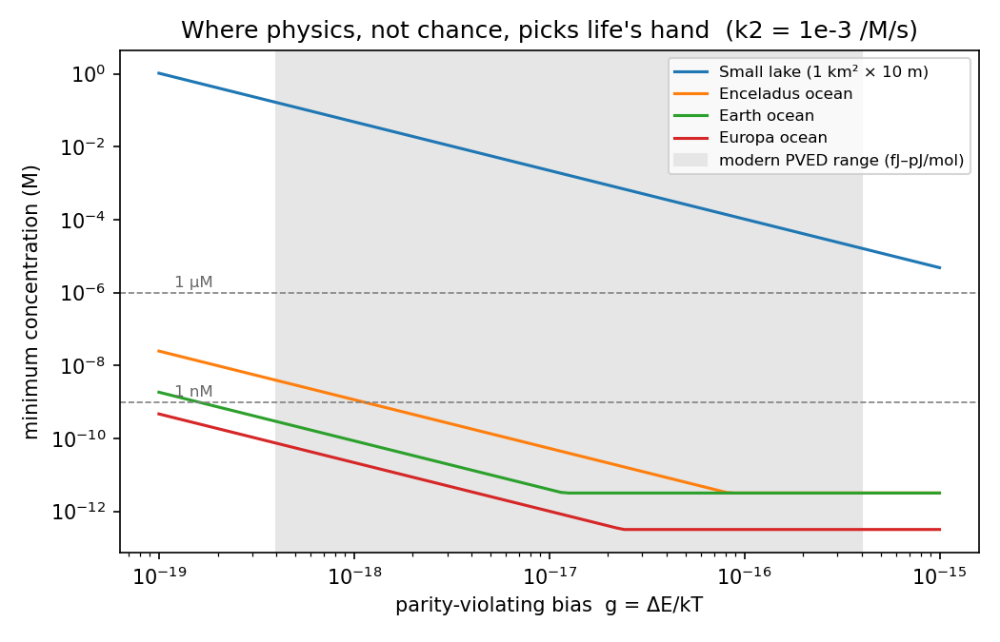
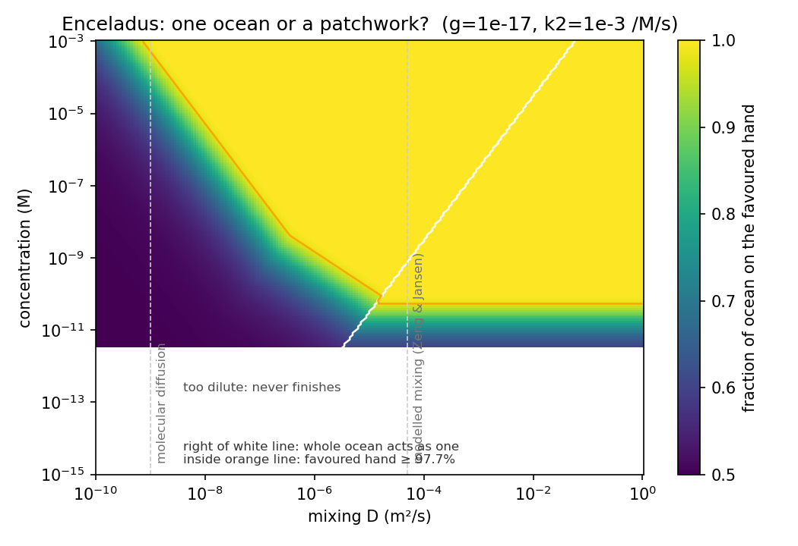
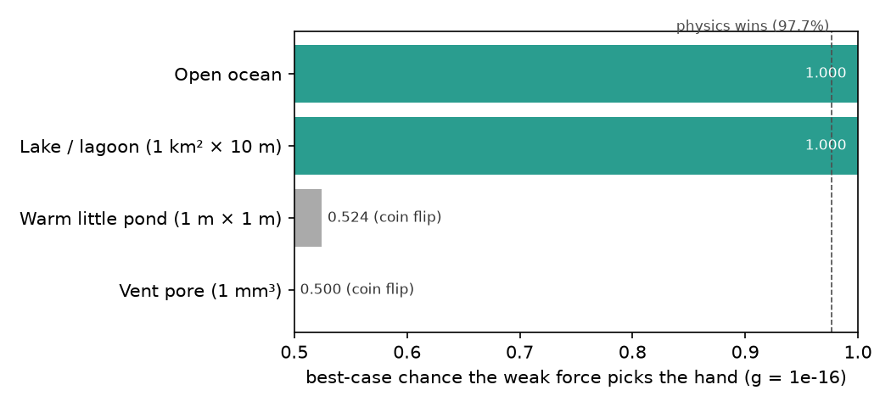

# Could the weak force pick life's hand in an icy-moon ocean?

## Summary
Life uses left-handed amino acids and right-handed sugars, and nobody knows why. One idea is that the
weak force (the one of nature's four forces that treats left and right differently) gives mirror-image molecules a tiny energy difference, which a large, slow, self-amplifying
chemical system could turn into a full preference. This project builds and checks (against stochastic
simulations in 1D and 3D, and against a real reaction scheme) the math for when that bias beats chance, and applies it to real oceans.

- **Size isn't the limit.** The oceans of Enceladus, Europa and early Earth hold far more than enough
  molecules. Ponds and vent pores hold too few, so there chance wins (Parts 1, 4).
- **A patchwork heals, but through layers.** In 3D, a patchwork (an ocean split into left- and right-handed regions)
  heals (ends up all one hand) and the majority wins. Icy-moon oceans mix fast sideways but slowly up and down, so the
  patchwork first settles into stacked layers of opposite hands. On a flat model ocean those layers freeze. On a round
  moon each layer boundary is a sphere and slowly sinks, so the top layer can take over, but the sinking speed is set
  by the slow **vertical** mixing. With weak vertical mixing that takes up to ~10¹²–10¹³ years, far longer than the
  moons have existed; layers merge in time in only about a third of plausible cases (Part 3b).
  **So vertical mixing again decides the icy-moon answer.**
  *(Correction 2026-09-26: this said the top layer takes over "within about 10⁴–10⁵ years" and that vertical mixing
  "matters much less". That used 2·D_h/R for the sinking speed; the right speed is 2·D_z/R, see Part 3b.)*
- **Pools can inherit a hand.** A pond follows an inherited excess as small as 6×10⁻¹². The weak force can't
  supply that directly (~5×10⁻¹⁸), but meteorites can (up to 18.5% L-excess), which makes meteorite seeding
  the simplest pond story (Part 4b).
- **L-amino acids + D-sugars:** mutual catalysis forces the pairing. Physics only picks between mirror pairs,
  using the *sum* of both biases. The sugar bias sign is unsettled and may cancel the amino-acid bias (Part 5).
- **The missing reaction:** no known chemistry combines self-amplification with early-Earth ingredients in
  water. Speed is never the obstacle, so slow experiments are the unexplored search space (Part 6),
  and a mirror-controlled 12-month experiment is designed in [EXPERIMENT.md](EXPERIMENT.md).

**Novelty check:** all 435 papers citing Kondepudi & Nelson 1985 (377) and Brandenburg & Multamäki 2004
(58) were scanned, plus keyword searches. None applies the weak-force criterion to icy-moon oceans, to
spatial patch formation, or to inheritance by pools. Closest: Sandars 2005 (spatial spread of handedness
in Earth's ocean, no weak force). Re-checked 2026-09-30: Cowan & Furnstahl 2022 and Cowan 2023 combine the PVED with
metal-catalysed autocatalysis in an early-Earth ocean, but with no molecule-number threshold and no icy moons; Hochberg et al. 2022
(PVED in noisy open systems) and Jannat et al. 2026 (supernova neutrinos) are related but not ocean worlds.

**Robustness (Part 8):** varying every uncertain input at once, physics wins in 75% of plausible cases (the share of
random, realistic input combinations where it wins) for early Earth's open ocean, 22% for Enceladus and 29% for Europa,
with vertical mixing the deciding input. The layers-merge-in-time condition holds in only 33% (Enceladus) and 34% (Europa) of all draws (Part 3b).
If they never merged, it would be only 3% and 7%.
A second reaction scheme and a thin-shell ocean both confirm the results.
*(Corrections 2026-09-25: this first said 18% for both moons, which used a vertical-mixing range for sideways healing
(see Part 3). It then said 43% and 58%, before layering was modelled (see Part 3b).)*
*(Correction 2026-09-26: on a round moon a layer boundary sinks at 2·D_z/R (vertical mixing), not 2·D_h/R as first written; on a sphere "down" follows the radius, so sideways mixing drops out (MEASURED, `sphere_layers.py`). So the numbers above went 55% → 22% (Enceladus), 78% → 29% (Europa) and 100% → 75% (early Earth),
and the deciding input went from concentration back to vertical mixing.)*

**Status:** every computational step is done and self-checked (`./run_all.sh`). The biggest open
computational question is how strong real icy-moon vertical mixing is (Part 3b); the wet-lab experiment is not yet run.

## Question
Life uses left-handed amino acids. One idea (Kondepudi & Nelson 1985) is that the
weak force gives left- and right-handed molecules a tiny energy difference (the
parity-violating energy difference, PVED), and a big enough, slow enough chemical
system can amplify that tiny bias instead of random chance. Nobody has applied that
size test to the oceans of Enceladus or Europa (checked: none of the 377 papers
citing K&N 1985 do; the icy-moon ones are all about *detecting* chirality).

## Hypothesis (written before running the ocean model)
Using modern PVED values (both signs) and including noise, an Enceladus-scale ocean
is large enough for the weak-force bias to beat chiral noise, but dilution may make
amplification too slow to finish within the ocean's lifetime.

## Method
1. `sim.py`: stochastic simulation of a chiral system slowly passing through its
   symmetry-breaking point (normal form of the Frank / K&N model). Derives and
   **checks** the selection formula

   `P(favoured hand) = Φ(Δ)`,  `Δ = √2 · π^¼ · g · (kτ)^¼ · √N`

   against 4,000 brute-force runs per point. It matches to within ±0.005 at every tested bias.
2. `ocean.py`: plugs in real ocean volumes and ages. Two conditions must both hold:
   - **size**: Δ ≥ 2 (favoured hand wins ≥ 97.7% of the time)
   - **time**: the autocatalysis actually finishes, `k2·c·τ ≥ 10`

   Output: the minimum concentration of the reacting molecules for each world.

## Results

| body | min. concentration (g = 1e-17, k2 = 1e-3 /M/s) |
|---|---|
| Small lake (1 km² × 10 m) | ~2 mM |
| Enceladus ocean | ~50 pM |
| Earth ocean | ~4 pM |
| Europa ocean | ~1 pM |



- **Size is not the problem for icy-moon oceans.** Across the whole modern PVED range,
  Enceladus needs well under 1 µM, and mostly under 1 nM. A small lake needs millimolar levels.
- **Time becomes the limit when chemistry is slow.** At k2 = 1e-6 /M/s the time
  limit sets the answer for every ocean (~3 nM for Enceladus). This is the dilution effect
  flagged by the 2019 *Origins of Life* paper.
- **Temperature jitter barely matters** in this model: noise in the driving parameter
  shifted P by < 0.01 (`sim.py`). The 2023 PCCP paper argues temperature can create
  truly *chiral* noise through a mechanism this model doesn't include. That's an open point.
- **Mixing matters most.** If only a fraction f of the ocean is well mixed, it acts like a
  bias of g·√f. A stratified Enceladus with 1% mixing is equivalent to a 10× smaller g.

**Verdict on the hypothesis:** the size part is supported. The dilution part holds only
if prebiotic autocatalysis is slow (k2 ≲ 1e-6 /M/s), and that rate is unknown.

## Part 2: one ocean or a patchwork?
Part 1 assumed the whole ocean decides together. A real ocean could break symmetry in
separate patches. `domains.py` adds mixing between neighbouring regions and **checks
three laws** against simulation (all pass):

| law | check |
|---|---|
| patch size at the transition `l = C·√(D/k)·(kτ)^¼` | 6 runs, C = 12.8, spread 3% |
| favoured hand invades at `v = (3/√2)·g·√(D·k)` | within 3% of prediction |
| each patch decides by the Part 1 formula, using its own molecules | K = 0.61, spread 7% |

`patches.py` applies these to the real moons. Closed-form result: **a "one ocean" outcome
is possible only if mixing D ≥ √10·L²/(C²·τ)**, i.e.

| moon | mixing needed | molecular diffusion | modelled mixing (Zeng & Jansen 2021) |
|---|---|---|---|
| Enceladus | 3×10⁻⁶ m²/s | 10⁻⁹ ✗ | 5×10⁻⁵ ✓ (~15×) |
| Europa | 1×10⁻⁵ m²/s | 10⁻⁹ ✗ | 5×10⁻⁵ ✓ (~4×) |

*(2026-09-25: the "modelled mixing" value is a vertical rate applied over the ocean's width; see the correction in Part 3.)*



- **With only molecular diffusion**, oceans break into km-scale patches and the favoured
  hand gets just 50–58% of Enceladus (up to 79% of Europa at 1 µM). That's a **mixed-hand ocean**, mostly decided by chance.
- **With the modelled mixing (5×10⁻⁵ m²/s)**, physics wins ocean-wide down to ~1 nM (Enceladus) or
  ~1 pM (Europa). Even where patches form, they're big enough that each one picks the favoured hand.
- **The bias alone can't heal a patchwork.** It pushes walls between patches at 10⁻²³ m/s
  or slower. Takeover would take 10²¹–10²⁷ years, far longer than the age of the universe (1.4×10¹⁰).
  **But in 3D, patches heal another way**; see Part 3.
- **New trade-off:** slow (dilute) chemistry helps coherence, because patches grow as
  √(D/k), but it risks never finishing. Fast chemistry finishes but fragments.

**Prediction for missions:** a well-mixed ocean should be single-handed ocean-wide.
Samples of *both* hands from different plumes or vents would point to poor mixing or no
weak-force selection. Checking this with several plume samples is a concrete test.

## Part 3: the 3D version changes the story
Running the same model on a 128³ grid (2 million cells) showed that the 1D patch-size law
**fails in 3D** (31% spread, `domains3d.py`). The reason, tested directly in `coarsen3d.py`:

- **Patches keep growing after the choice.** In 3D, patch walls are curved surfaces. They
  straighten themselves out, so small patches shrink and vanish, with no bias needed.
  Measured: size grows as `l = A·√(D·t)` (exponents 0.45 and 0.49 vs. theory 0.5; A = 5.48
  and 5.60 at the two mixing strengths). In 1D a wall is a point with no curvature, so this can't happen.
  That's why Part 2 missed it.
  *(Correction 2026-09-23: this said "A = 5.5 at both"; `coarsen3d.py` prints 5.48 and 5.60, so
  the second value rounds to 5.6. The conclusion (same growth law at both strengths, within ~2%) is unchanged.)*
- **The majority hand takes over.** Starting from ready-made patches:

  | start (favoured) | t = 50 | t = 200 | t = 400 |
  |---|---|---|---|
  | 50% (control) | 50% | 50% | 47% |
  | 52% | 57% | 62% | 65% |
  | 55% | 66% | 81% | 93% |

  This matches standard phase-ordering physics (non-conserved coarsening, e.g. Bray 1994).
- **So a patchwork ocean heals**, in about `t = (L/A)²/D`, and the winner is the
  *ocean-wide majority*. That majority is set by the weak-force bias summed over all patches,
  so the answer moves back toward the whole-ocean result of Part 1.

| body | heals within its age if D ≥ | with molecular diffusion | with modelled mixing |
|---|---|---|---|
| Enceladus | 6×10⁻⁶ m²/s | 6×10¹¹ yr ✗ | 1×10⁷ yr ✓ |
| Europa | 2×10⁻⁵ m²/s | 2×10¹³ yr ✗ | 4×10⁸ yr ✓ (just) |
| Earth | 4×10⁻³ m²/s | 4×10¹⁴ yr ✗ | ~400 yr (horizontal eddies) ✓ |

**The corrected bottom line:** the mixing threshold (~10⁻⁵ m²/s for the icy moons) is almost the
same whether the ocean acts as one system at the start (Part 2) or heals later (Part 3). The
conclusion is robust: **with eddy-driven mixing, physics picks the hand ocean-wide. With only
molecular diffusion, you get a frozen mixed-hand ocean.** What Part 3 changed is the *mechanism*:
the patchwork doesn't stay frozen, it heals within 10⁷–10⁸ years.

**Caveat on mixing (corrected 2026-09-25).** Ocean mixing is much faster sideways than up and down, so the two
directions need separate numbers. Parts 2–3 and 8 originally used a single mixing value D for healing *across* the
ocean, and took its range, 10⁻¹⁰ to 10⁻³ m²/s, from Zeng & Jansen 2021. On re-reading, that range is their estimate
for **vertical** mixing (κ_z, their Section II.2), and the 5×10⁻⁵ m²/s in the tables above is also a vertical value
(DOCUMENTED). The same paper says sideways mixing is "much larger than the vertical" and that sideways mixing across a
hemisphere takes about 1000 years in their simulation. Zhang, Kang & Marshall 2024 estimate sideways eddy mixing in
Enceladus's ocean "of order ~0.1 m²/s" (DOCUMENTED).

What this changes:
- **Across the ocean:** healing needs sideways mixing ≥ ~6×10⁻⁴ m²/s (Enceladus) or ~2×10⁻⁴ m²/s (Europa). That's
  about 180–450× below the ~0.1 m²/s estimate, and still 50–140× below 0.03 m²/s, the low end of the runs in
  Zhang et al. So **sideways healing is not a limit** (MEASURED from the rule above).
- **Top to bottom:** the patchwork also has to heal over the ocean's depth (≈40 km Enceladus, ≈120 km Europa,
  from the volumes used here). That needs vertical mixing ≥ ~2×10⁻⁹ to 2×10⁻⁶ m²/s (Enceladus) or ~4×10⁻⁹ to
  2×10⁻⁷ m²/s (Europa), depending on the ocean's age. At the same age, that's about 330× (Enceladus) and
  1400× (Europa) lower than the old one-number threshold, because the depth is much shorter than the width. But the
  thresholds still sit inside the 10⁻¹⁰–10⁻³ vertical range (MEASURED; `uncertainty.py` checks these).
- So the model still doesn't settle the icy-moon answer, and physics wins in more of the plausible range than first
  reported (43% and 58%, not 18%). *(Update, same day: the top-to-bottom rule above turned out to be the wrong
  picture for most of the range; see Part 3b. The numbers then became 55% and 78%; after the 2026-09-26 correction in
  Part 3b they are 22% and 29%.)*
  The Part 2 and Part 3 tables above are left as first reported. Read their "mixing" column as vertical mixing
  applied over the ocean's width, which is the pessimistic case.
- The caution first written here, that layers might stall, is now tested in Part 3b. They do stall in a flat box,
  but not on a round moon.

### Part 3b: a layered ocean (`aniso3d.py`, added 2026-09-25)
**A shortcut.** In this model, weak vertical mixing is *exactly* the same as equal mixing in a taller ocean. Stretch the
depth by √(D_h/D_z) and the equations become the equal-mixing ones, because the chemistry term has no mixing in it.
The stretched ocean is deeper than it is wide whenever D_z < D_h/333 (Enceladus) or D_h/1400 (Europa), which covers
96% (Enceladus) and 92% (Europa) of the plausible range in Part 8. So the test is simple: compare flat, cube-shaped and
tall boxes (32 wide, 8 / 32 / 128 deep; periodic sideways; closed top and bottom; 4 seeds; 50% and 55% starts; t = 1000).

| box (stands for) | 55% start: ends as one hand | 50% start: ends as one hand | stuck as stacked layers |
|---|---|---|---|
| flat, 8 deep (strong vertical mixing) | 2/4 | 2/4 | 0/8 |
| cube, 32 deep | **4/4** | 3/4 | 1/8 |
| tall, 128 deep (weak vertical mixing) | 1/4 | 0/4 | **7/8**, 3–5 layers each, frozen from t = 500 to 1000 |

(MEASURED, `aniso3d.log`.) The flat box's failures are not layers. They are two straight stripes that wrap around the
small periodic box, a known artifact of periodic boxes. On a sphere, a band's two edges can't both be great
circles (two great circles always cross), so at least one edge is curved and shrinks. The one stationary split,
two hemispheres divided by a single great circle, is unstable: any tilt shortens the boundary. That's an argument,
not a spherical simulation (ASSUMED).

**So with weak vertical mixing, the patchwork freezes into layers of opposite hands**, as predicted. A flat boundary
between two layers has no curvature, so nothing pushes it.

**On a round moon, the layers can merge, but slowly.** A layer boundary there is a sphere (radius ≈ the moon's), and a curved
boundary moves at D × curvature. Two checks in `aniso3d.py`:
- A shrinking circle follows the textbook law (Allen & Cahn 1979) to within 7.1% (MEASURED).
- A wavy boundary with uneven mixing flattens at a rate set by **sideways** mixing only: 0.00967 vs 0.00964 predicted
  (sideways 4×, vertical 1×), and 0.00239 vs 0.00241 (sideways 1×, vertical 4×) (MEASURED). With equal mixing the grid
  drags the sharpest boundary about 20% slow; that case is reported but not used.

Those checks are right for a flat box, but they don't carry over to a sphere. On a sphere "down" follows the radius,
so a boundary at constant depth has no sideways variation at all: only vertical mixing D_z acts on it, and it sinks at
**2·D_z/R**. Each inner layer shrinks away, and the top layer takes over in about H·R/(2·D_z). At the weakest vertical
mixing considered (10⁻¹⁰ m²/s) that is up to 1.5×10¹² years (Enceladus) or 2.8×10¹³ years (Europa), far longer than
either ocean's age. The layers-merge-in-time condition holds in 33% (Enceladus) and 34% (Europa) of the Part 8 draws (MEASURED from the
rule; `uncertainty.py` checks it).
*(Correction 2026-09-26: on a round moon a layer boundary sinks at 2·D_z/R (vertical mixing), not 2·D_h/R as first written; on a sphere "down" follows the radius, so sideways mixing drops out (MEASURED, `sphere_layers.py`). This paragraph first said the boundary sinks at 2·D_h/R "however weak vertical mixing is", so the top
layer took over within at most 1.5×10⁴ years (Enceladus) or 2.8×10⁵ years (Europa). The flat-box wavy-wall check
(dh/dt = D_h∇²h) is correct but doesn't apply on a sphere.)*

**Sphere test (`sphere_layers.py`, added 2026-09-26).** A direct simulation on a spherical shell (`sphere_layers.log`):
- A layer wall sank at 0.991, 0.991 and 0.984 of the 2·D_z/r prediction, and its speed changed by 0.0% when sideways
  mixing was made 4× stronger (MEASURED). So the speed follows vertical, not sideways, mixing.
- A two-hemisphere split along a great circle is unstable, as argued above: shifted slightly, it grew at 1.017× the
  predicted rate, and a band from 10°N to 50°N vanished (MEASURED); a split exactly on the great circle stayed at 0.50.
  A tilt is just a rotation, so it cannot matter (argument, not a run).
- A column-like shell (4× deeper than wide in stretched units) started at 50% froze into stacked layers; their share changed
  by ±0.013 over t = 500→1000, matching the predicted slow creep (±0.013; post-hoc check, 2 runs). The top layer held a share of 0.52 and 0.07 of the ocean in 2 runs, vs the L/H' = 0.25 used
  in Part 8. Two runs neither support nor rule out that rule, so it stays ASSUMED.
- *(Added 2026-09-27.)* The runs above changed vertical mixing D_z only together with the grid spacing. So we re-ran
  on a fixed grid (dz = 0.02) with D_z = 0.0008, 0.0016 and 0.0032. The wall sank at 0.967, 0.986 and 0.995 of 2·D_z/r
  (r = the wall's middle-depth radius), and each doubling of D_z doubled the speed (×2.04, ×2.02) (MEASURED,
  `sphere_layers.py 1d`, `sphere_layers_1d.log`; 1 seed, R = 16). The first planned try (`1c`, half as deep,
  `sphere_layers_1c.log`) failed at D_z = 0.0032 (1.39×). That wall ended only ~1.6 wall-widths above the closed sea
  floor and seems to have been pulled in. `1d` doubled the depth, a fix chosen after seeing that failure, and the problem
  went away. So on a fixed grid the speed still follows D_z. The weakest case is barely resolved (~1.4 cells wide), so its
  3% shortfall may come from the grid.
  *(Added 2026-09-27 23:30.)* Two more seeds (`sphere_layers.py 1e`, `sphere_layers_1e.log`) gave the same ratios to 3 decimals
  (0.967 / 0.986 / 0.995; spread 0.000) (MEASURED). The seed only sets the pattern of small bumps on the wall (typical
  size 1.5 grid steps), and sideways mixing smooths them out quickly, so this match was expected. It rules out
  random luck for this one setup (R = 16, D_h = 1, one grid) only. The open limits are still the grid and the depth
  (see 1c above).
The full test takes about 22 minutes (`./run_all.sh --full`).

**What picks the top layer's hand?** Its own majority, set by the weak-force bias summed over the molecules in that
layer. In the tall-box runs the favoured hand ended on top in 3/4 runs from a 55% start vs 2/4 from 50%. That's
consistent but only 8 runs. The top layer is taken to be about as thick as the ocean is wide *in stretched units*
(the runs show 3–5 layers in a box 4× deeper than wide), i.e. a share L/H' of the molecules (ASSUMED). Fewer molecules
means a weaker push from the weak force, which is why concentration and the bias still matter in Part 8.

**Limits:** the sphere test (`sphere_layers.py`) is small and few-seeded. The
top-layer thickness is an estimate (2 runs, ASSUMED). Four seeds per case in small boxes.

Limits of Part 3: finite boxes (128³), so the late-time takeover (the 55% run reached 93% as
patches hit the box size) is shown qualitatively, not as an exact rate. The growth law
assumes the chemistry stays switched on the whole time.

**3D per-patch check (`k3.py`):** stopping just after the transition, the favoured fraction in 3D follows
the same formula with a constant that is consistent to 1% across three bias strengths (effective
decision volume ≈ 60 cells at D = 1, γ = 0.1). Combined with majority takeover, the ocean-wide outcome
follows the Part 1 whole-ocean formula to within a factor of ~1.5. (The patch size measured that early,
2.5 cells, is noise-dominated. Only the combined effective volume is meaningful.)
*(Correction 2026-09-23: this said "≈ 57 cells". That number multiplied K3 by the rounded patch size 2.5³;
the unrounded size is 2.548, and `k3.py` now prints the volume directly: 60.2 cells, MEASURED. The factor-of-1.5
conclusion is unchanged.)*
**Seed replication (`k3_seeds.log`, MEASURED 2026-09-23):** three more random seeds give K3 = 3.698, 3.481, 3.652
(original 3.642). Across all four the spread is 2.3%, and the effective volume from each run's favoured fractions is
57–61 cells. The within-run "1%" is partly built in, because the three bias strengths in one run reuse the same
random noise. The spread between seeds (2.3%) is the fairer measure, and it is still small.

### Earth check
Early Earth ocean (1.33×10¹⁸ m³, mean depth 3.7 km), with 10⁷–5×10⁸ yr before life:
a one-ocean outcome needs D ≥ 5×10⁻⁴ to 2×10⁻² m²/s. Typical modern ocean mixing:
horizontal eddies ~10³ m²/s (≲10³ to ~10⁴, Abernathey & Marshall 2013; ≫ needed); vertical ~10⁻⁵ m²/s
(1.1×10⁻⁵, Ledwell et al. 1993 tracer release).
- Horizontal eddy mixing: the favoured hand wins ocean-wide at ≥ 1 nM.
- Vertical mixing only (pessimistic): 94% at 1 nM, 100% at 1 µM.
- **So Earth's ocean fits the conditions, but only if handedness was chosen in the open ocean.**
  If it was chosen in a pond, lagoon or vent pore (a popular view, because the open ocean is so dilute),
  the small-lake case applies: millimolar concentrations are needed, and chance likely wins.
- Earth being left-handed **can't confirm this**. All life shares one ancestor, so any
  mechanism, chance included, ends with one hand. That's why a *second, independent* ocean
  (Enceladus, Europa) is the real test.

## Part 4: where was the hand decided? (`scenarios.py`)
Same formula, applied to each proposed origin-of-life setting. If life began in one
isolated setting, its number is the chance that physics, not luck, picked the hand.

| setting | size | concentration (assumed range) | chance physics wins |
|---|---|---|---|
| Open ocean | 1.3×10¹⁸ m³ | 0.1–100 µM | **~100%** |
| Lake / lagoon | 10⁷ m³ | 10 µM–10 mM | 51–100% (needs ≳ mM) |
| Warm little pond | ~3 m³ (Pearce 2017) | 1 µM–10 mM | **50–52%: coin flip** |
| Vent pore | ~1 mm³ | 0.1 mM–1 M (Baaske 2007: up to 10⁸× concentration) | **50%: coin flip** |



**The central tension:** the places chemists favour *because* they concentrate molecules
(ponds, vent pores) are exactly the places where physics **loses**. They hold too few molecules
in total. The places where physics wins (open ocean, big lakes) are where chemistry
struggles with dilution. So:
- If life's hand was decided in an *isolated* pond or vent pore, it was **chance**, unless the pool inherited an excess (Part 4b).
- If the weak force decided it, the decision had to happen at **lake-to-ocean scale**. Small
  pools could still have *inherited* that bias from the water feeding them, but this model
  doesn't test that. It's a clear next step.

Concentrations are the weakest inputs here. Stribling & Miller 1987 estimated a relatively
rich early ocean: about 3×10⁻⁴ M amino acids at steady state (and ~4×10⁻⁶ M of the starting
molecule HCN, at pH 8 and 0 °C). This is DOCUMENTED from the paper's own abstract. I could not find a
specific paper that gives a *lower* number, so treat 3×10⁻⁴ M as one contested estimate, not the
consensus. Pond and lagoon values are assumptions.
*(Correction 2026-09-23: an earlier version said "later work revised it downward" with no source. That
claim is withdrawn until a source is found. No number in the tables changed.)*

### Part 4b: can small pools inherit a bias? (`inherit.py`)
A pool fills with water that already carries a small excess e0, then concentrates until
its autocatalysis switches on. Theory (checked against 4,000 runs per case, 5 cases, within 0.006):

`pool follows the inherited hand reliably once  e0 ≥ 2·(π·k·τ)^¼ / √(2N)`

| pool | inherited excess needed |
|---|---|
| Lake / lagoon | 3×10⁻¹⁴ |
| Warm little pond | 6×10⁻¹² |
| Vent pore | 1×10⁻⁶ |

| possible source of the excess | excess it supplies | enough? |
|---|---|---|
| weak force alone, at equilibrium (≈ g/2) | ~5×10⁻¹⁸ | **no**, 10⁴–10¹¹ too small |
| an ocean that already amplified the weak-force bias (Parts 1–3) | up to ~1 | yes |
| meteorites: Murchison L-isovaline (Glavin & Dworkin 2009) | 0.185 | **yes, by 10⁵–10¹³×** |

**What this means:**
- Pools are **extremely sensitive amplifiers**. A pond follows an inherited excess of just 6 parts
  in a trillion. So "life started in a pond" does **not** force the answer to be chance.
- But the weak force can't hand pools enough excess *directly*. It works only if a big body of water
  (a lake or the ocean) amplified the bias first. So pools don't get around the ocean-scale
  requirement: **the weak-force story still needs large-scale autocatalysis somewhere upstream.**
- **Meteorites easily supply enough.** An 18.5% excess could be diluted about 10¹⁰-fold and still set a pond's hand.
  This makes the space-delivery explanation (the excess made in space, e.g. by circularly polarised
  starlight, then delivered by meteorites) the **simplest** way to seed pools. Caveat: isovaline
  isn't a protein amino acid. Its excess would have to be passed on by catalysis, which
  Pizzarello & Weber 2004 showed with isovaline → D-sugar.

## Part 5: the dual explanation, L-amino acids with D-sugars (`dual.py`)
Proteins use L-amino acids; DNA/RNA use D-sugars. Real chemistry links them in both directions:
- **amino acid → sugar:** L-amino acids catalyse D-sugar excess (Pizzarello & Weber 2004;
  Breslow & Cheng 2010). Slightly enantioenriched proline drives an enantiopure RNA
  precursor (Hein, Tse & Blackmond 2011).
- **sugar → amino acid:** D-RNA prefers loading L-amino acids, about 4× (Tamura & Schimmel 2004).
  Mirror-image RNA prefers D.

Model: two chiral systems (amino acids, sugars) cross the transition together, each helping the
*partner* hand with strength κ. Checked against 4,000 runs per case (all pass):

1. **Coupling forces the pairing.** Without coupling, the hands match 50% of the time.
   With κ ≈ √γ they match 99.9% of the time. This holds at two sweep speeds (a scaling
   law), so the cross-catalysis only needs to be ~1/√(kτ) as fast as self-amplification,
   well under 1% for slow natural chemistry.
2. **Which pair wins depends on the *sum* of the two weak-force biases:**

   | bias toward L-aa | bias toward D-sugar | predicted P(L-aa + D-sugar) | simulated |
   |---|---|---|---|
   | 1e-3 | 0 | 0.663 | 0.669 |
   | 1e-3 | 1e-3 | 0.800 | 0.797 |
   | 1e-3 | −1e-3 (favours L-sugar) | 0.500 | 0.513 |
   | 2e-3 | −1e-3 | 0.663 | 0.669 |

**What this means:** the *pairing* (L with D) is explained by chemistry alone. Physics only
has to choose between the two mirror pairs. That makes the weak-force story *easier*: it
needs one combined decision, not two separate ones. But **if the weak force favours L-amino acids
and also L-sugars, the two pushes cancel**, and the hand is back to a coin flip.

What the calculations say (literature check):
- **Amino acids:** modern gas-phase calculations favour natural L-alanine. In water the sign becomes
  conformation-dependent and unsettled ("the conformation problem", 2009).
- **Sugars:** older (1980s–90s) calculations leaned toward natural D-sugars, but the result flips with
  ring shape, and the authors later corrected the size of their headline effect. A 2005 calculation on a
  whole DNA double helix (Faglioni, D'Agostino, Cadioli & Lazzeretti) concluded, in its own abstract, that
  the weak force does **not** favour the double helices found in nature. That is now checked against the
  primary abstract (it used to rest on secondary summaries). Caveats: the abstract says "not the natural
  helix", which is not quite the same as a strong push toward the mirror helix. I couldn't read the full
  paper (paywalled), so its helix shape, solvent treatment and effect size are unchecked. Of the 21 later
  papers citing it (OpenAlex), none reverses it.
- **Net:** there's no settled sign for sugars, and some evidence points the "wrong" way. By this model, a
  wrong-way sugar bias would partly **cancel** the amino-acid bias.

So pinning down the sugar PVED sign is the most useful missing number for the whole weak-force hypothesis.

## Part 6: a spec sheet for the missing reaction (`scorecard.py`)
Every part above assumes a self-amplifying chiral chemistry, and none is known under
early-Earth conditions. The models can't name the molecules, but they do set **requirements**:

| | requirement | from |
|---|---|---|
| R1 | each hand makes more of itself | growth term, `sim.py` |
| R2 | the two hands suppress each other | saturation term; Frank 1953 |
| R3 | driven: energy or feed keeps it from drifting back to 50/50 | open-system assumption |
| R4 | works in water from simple early-Earth molecules | prebiotic plausibility |
| R5 | fast enough: k2 ≥ 3×10⁻⁷ /M/s (pond, lake), 3×10⁻⁹ (ocean) | time rule, `ocean.py` |
| R6 | works from a racemic or tiny excess (a pond follows 6×10⁻¹²) | `inherit.py` |
| R7 | product is an amino acid, sugar or nucleotide (or passes its hand to one) | biology |

Scored from the literature (Y = meets, P = partly, N = fails, ? = no data):

| candidate | R1 | R2 | R3 | R4 | R5 | R6 | R7 | score |
|---|---|---|---|---|---|---|---|---|
| Attrition deracemization, amino-acid derivative (Noorduin 2008) | Y | Y | Y | P | Y | Y | P | **6.0** |
| Ghadiri peptide replicator (2001) | Y | Y | P | N | Y | Y | Y | 5.5 |
| Viedma ripening, NaClO₃ (2005) | Y | P | Y | P | Y | Y | N | 5.0 |
| Magnetite crystallization (Ozturk 2023) | N | N | P | Y | Y | Y | Y | 4.5 |
| Soai reaction (1995; from 5×10⁻⁷ ee in 2003) | Y | P | P | N | Y | Y | N | 4.0 |
| Joyce RNA cross-inhibition (1984) | N | Y | P | Y | ? | N | Y | 3.5 |
| Blackmond eutectic (2006) | N | N | N | P | Y | P | Y | 3.0 |

**The pattern (the main finding of this part):** the candidates *with* self-amplification (R1)
fail on prebiotic inputs (R4). The candidates that are prebiotic (R4) lack self-amplification.
**No known system has R1 + R2 + R4 + R7 together.** Speed (R5) is *never* the problem.
Natural chemistry has 10⁵–10⁸ years, so even extremely slow reactions qualify.

**Prediction:** the missing reaction is **self-amplifying chirality in water, from natural
building blocks, even if very slow.** Lab searches usually discard reactions that don't amplify
within days. The spec says a reaction taking *years* at 10 mM (k2 ~ 10⁻⁷ /M/s) would be enough.
**Slow, long-running experiments are the under-explored search space.**

Two partial routes already cover the gap between them:
- **Magnetite (2023)** starts from racemic, prebiotic RNA precursors and needs no autocatalysis
  (~60% ee, then crystallization to pure).
- **Attrition deracemization** gives complete deracemization with grinding and a racemizing solution.

A pool combining a surface step (to break symmetry) with crystallization (to amplify) would meet
most of the spec *without* classic autocatalysis. So R1 may not be strictly needed when an outside
chiral influence does the symmetry breaking. One open issue: if the mineral's magnetization sets the
hand, then different pools could get different hands unless their magnetization is aligned.
Ozturk et al. do address this: they argue that magnetite sediments magnetized by Earth's field after its
most recent flip would carry a "statistically uniform" magnetization **across a hemisphere**. But in their
own lab test, flipping the magnet flipped the hand. So the two hemispheres could pick *opposite* hands,
and the paper doesn't say how that gets resolved. (DOCUMENTED from the full text, PMC10246896. The
opposite-hemisphere point is my inference, not the paper's claim.)

Scoring limits: several concentrations and times weren't in the abstracts. Marks are judgement
calls from the papers' main claims, not a formal meta-analysis.

**Next step, designed:** a seeded, mirror-controlled slow experiment (0.1 M, 12 months) that can
detect amplification as slow as the pond floor. See [EXPERIMENT.md](EXPERIMENT.md) and `design.py`.

## Part 7: does a real reaction scheme obey the formula? (`frank.py`)
Every part above uses a simplified stand-in for the chemistry (the "normal form"). To check the conversion
to real reactions, `frank.py` simulates an actual Frank-type scheme in a flow reactor: slow uncatalysed
production, self-copying biased by g, the two hands destroying each other, and outflow. Each reaction
contributes its own molecular counting noise.

| bias g | reactor size Ω | sweep time | predicted | simulated |
|---|---|---|---|---|
| 0 | 10⁴ | 800 | 0.500 | 0.485 |
| 0.003 | 10⁴ | 800 | 0.737 | 0.733 |
| 0.003 | 10⁴ | 3200 | 0.858 | 0.854 |
| 0.006 | 10⁴ | 3200 | 0.999 | 0.974 |
| 0.002 | 4×10⁴ | 3200 | 0.909 | 0.898 |
| 0.003 | 10⁴ | **200 (fast)** | 0.628 | 0.680 |

- **In the slow limit, which is nature's, real chemistry follows the formula** (within ~1 percentage point for the biased rows;
  2.5 points near saturation. The no-bias control lands at 48.5% instead of 50%, which is 1.5 points low; 2026-09-26 note, ASSUMED to be run-to-run noise).
- **A fast sweep selects *more* strongly than predicted**, so the formula errs on the conservative side.
- **The conversion factor is now known:** compared with the simple mapping in `ocean.py` (bias g, noise 1/N),
  the real scheme's selection strength is lower by **F = √(x/(k0+2x)) ≈ 0.7**. The reason: every reaction that
  adds or removes a chiral molecule adds noise, not just the self-copying ones. So **every required
  concentration in Parts 1–4 rises by about 1.6×** (F^(−4/3)). No conclusion changes: the margins were
  10–10⁶×, except the Europa mixing margin, which isn't concentration-based.

## Part 8: robustness checks (optional extras)

**Uncertainty sweep (`uncertainty.py`).** 200,000 random input sets per world, every uncertain input varied at
once over its plausible range: bias g, rate k2, concentration, sideways mixing D_h, vertical mixing D_z, time, volume ±30%, and the chemistry
factor F (0.3–0.7). "Physics wins" requires all three: the chemistry finishes, the patchwork heals, and F·Δ ≥ 2.

| world | physics wins (round moon) | if layers never merged | most decisive input |
|---|---|---|---|
| Early Earth open ocean | **75%** | 40% | **vertical mixing D_z**: 52% (low half) vs 97% (high half) |
| Enceladus | **22%** | 3% | **vertical mixing D_z**: 0% vs 43% |
| Europa | **29%** | 7% | **vertical mixing D_z**: 0% vs 57% |

Next come concentration (+21 Enceladus, +10 Europa) and time (+15, +11; +32 for Earth), then the bias g (+8, +4) and rate k2
(+5). Faster sideways mixing lowers the win rate slightly (−2 to −9). F and volume ≤ 2 (moons). Layers merge in time in
only 33% (Enceladus) and 34% (Europa) of draws; sideways healing always finishes (MEASURED, `uncertainty.log`).
**So on a round moon, the question is again mostly how strongly the ocean mixes up and down.**
The second column shows how much rides on layers merging: without it, almost every icy-moon case ends as layers of
opposite hands.
*(Corrections 2026-09-25: this table first said 18% for both moons, with "mixing D" at 0% (low half) vs 36–37% (high
half). That run used one mixing range, Zeng & Jansen's vertical 10⁻¹⁰–10⁻³ m²/s, for healing across the whole ocean.
A second version split sideways (10⁻²–10² m²/s) and vertical (10⁻¹⁰–10⁻³ m²/s) mixing and gave 43% and 58% with vertical
mixing deciding. It still treated top-to-bottom healing like ordinary patch growth, which Part 3b shows is wrong
when the ocean layers. `uncertainty.py` checks the current numbers with asserts.)*
*(Correction 2026-09-26: on a round moon a layer boundary sinks at 2·D_z/R (vertical mixing), not 2·D_h/R as first written; on a sphere "down" follows the radius, so sideways mixing drops out (MEASURED, `sphere_layers.py`). With layering modelled, this table said 100% / 55% / 78% with concentration deciding (21% vs 89%, 57% vs
99%), bias g +18 to +23, k2 +14, vertical mixing +10 to +14, and "layer merging always finishes in time".)*

**Second reaction scheme (`frank2.py`).** Frank's scheme plus wasted back-reactions (L → A, 2L → A + L). It
matches the formula within 1.7 points in the slow limit, and the conversion factor is **F = 0.71**, the same as
scheme 1 (0.70). The 1.6× concentration correction from Part 7 holds for both schemes tested (MEASURED).

**Thin ocean shell (`shell3d.py`).** Real icy-moon oceans are 18–46× wider than deep. In a 512 × 512 × 8 slab
(closed top and bottom), 4 seeds each:

| start (favoured) | after t = 200, thin shell | cube (Part 3) |
|---|---|---|
| 50% (control) | 49.8% ± 1.4 | 50% |
| 52% | **56.1% ± 1.4** | 62% |
| 55% | **65.4% ± 0.5** | 81% |

The majority still takes over in a thin shell, but **more slowly**. Patch growth exponent 0.41 vs 0.45–0.49
in the cube, so Part 3's healing times are, if anything, optimistic by a modest factor. A first single-seed
run in a 256-wide box *failed* (52% → 44%). That was finite-size noise (only ~8 patches), not physics,
and it's recorded in `AUTONOMOUS_LOG.md` (MEASURED).

## Part 9: newest checks (`review.py` R6–R8, added 2026-09-30)
- **Closed rock fades, driven ocean holds (R6).** Run with its making steps reversible (detailed balance), the same amplifier
  rises to a large excess and then falls back to 50/50 in a closed rock whose heat runs out, but holds
  in an ocean that vents keep driving. That is why Bennu's racemic amino acids fit the model: odds stay
  22% / 29% / 75% (Enceladus / Europa / early Earth). Without this rule they would drop to 2% / 4% / 15%.
- **Molecules flipping hand (R7).** Random racemization adds no bias, only noise: the chance the weak
  force wins drifts from 72% to 67% as flipping rises to 0.45 of the amplifier rate. If flipping
  outpaces amplification, no hand is chosen.
- **Beta-decay electrons (R8).** Spin-polarized electrons from radioactive decay (Vester–Ulbricht) could
  add a second weak-force bias. With the measured asymmetry (~3 × 10⁻⁴, Dreiling & Gay 2014) it matches
  the PVED once about 1 molecule in 10¹³ is destroyed per reaction time. In a borderline ocean it moves the
  odds from 84% to 98% (same direction) or 50% (opposite). Its sign for amino acids in water is unmeasured,
  so the main model leaves it out.

## What this means
*If* a self-amplifying chiral chemistry existed in an icy-moon ocean, the weak force,
not chance, should decide the hand. Then finding **right-handed** life on Europa
or Enceladus would count *against* weak-force selection (or show that the PVED sign favours D).
Finding a mix of both hands in different places would count against it too.

One caution: meteorite seeding (Part 4b) *also* predicts left-handed life throughout the Solar System,
because all its bodies received the same meteoritic material. So Enceladus and Europa can test **physics or
same-source seeding vs. chance**, but they can't separate the weak force from meteorites. Only life from another
star system could do that.

## Limitations (important)
- Order of magnitude only. The conversion to real chemistry is checked for one reaction scheme (Part 7:
  concentrations ×1.6). Other schemes with more non-productive turnover would give a smaller F.
- Part 2's patch laws are 1D. Part 3 adds 3D coarsening, and `k3.py` confirms the per-patch law in 3D;
  3D runs use finite 128³ boxes.
- Real ocean turbulence is not simple diffusion. Vertical mixing in icy-moon oceans is a model input
  (Zeng & Jansen 2021), uncertain over 10⁻¹⁰–10⁻³ m²/s. Sideways mixing is much faster (~0.1 m²/s, Zhang et al. 2024)
  and never limits healing here. With weak vertical mixing the ocean forms layers; layers merge only as fast
  as vertical mixing allows (Part 3b, `sphere_layers.py`), so vertical mixing is again the key unknown.
  *(Note 2026-09-27, `vertical_mixing_lit.md`: Zeng & Jansen 2021 is still the only primary estimate. Their Sec. 2.2 was
  re-read this date and gives 3×10⁻¹⁰ to 3×10⁻³, DOCUMENTED. Ames et al. 2025 quote "10⁻⁷ to 10⁻³" citing the same paper,
  so theirs is not a second estimate. Modellers run 5×10⁻⁵ to 5×10⁻³, which clears the merge bar, but those values are
  chosen partly so the simulation runs. The same Sec. 2.2 notes that
  molecules spread by themselves at ~10⁻⁹ m²/s. Below that, D_z really means "molecular only". That changes no percentage,
  since those draws never merge either way. But the worst-case merge times quoted at 10⁻¹⁰ (1.5×10¹² / 2.8×10¹³ yr) would
  be ~10× shorter at the 10⁻⁹ floor. That is still far longer than the Solar System's age. No Europa-specific value was
  found, so Europa uses the Enceladus range, ASSUMED.)*
- τ (how slowly conditions change) is set to the ocean's age, the most favourable case.
- No known prebiotic reaction does this kind of autocatalysis. The Soai reaction does it
  in the lab but isn't prebiotic. The rate k2 is a swept assumption.
- PVED has never been measured, and its sign for amino acids in water is unsettled
  (the "conformation problem", 2009).
- Enceladus ocean volume (2.7×10¹⁶ m³, used throughout Parts 1–3 and 8) is derived from shell and core
  geometry, not measured directly. DOCUMENTED: Čadek et al. 2016 (*Geophysical Research Letters* 43,
  DOI: 10.1002/2016GL068634) give an ice shell 18–22 km thick on average and a core radius 180–185 km from
  Cassini gravity/shape/libration data; subtracting those from Enceladus's known ~252 km shape radius and
  taking the spherical-shell volume over the ends of those ranges gives 2.45–2.93×10¹⁶ m³, which brackets
  the 2.7×10¹⁶ m³ figure used here (MEASURED; `ocean.py` checks this with an assert). The ocean's age is
  separately debated (1 Myr–1 Gyr).

## How this was made (AI-use disclosure)
Built in conversation with an AI assistant (Claude). The student chose the questions and direction.
The AI wrote the code, ran the simulations, searched the literature, and drafted this write-up.
Every quantitative claim is either computed by a script in this folder (with a self-check) or tied to a cited
source. Several literature numbers were confirmed only via abstracts or secondary summaries, and they are
flagged where used. Competition entries should follow their own AI-disclosure rules.

## Run
```
python sim.py     # formula check (asserts), ~25 s
python ocean.py   # threshold table + threshold.png
python domains.py # spatial law checks (asserts), ~2 min
python patches.py # moon regime map + patches.png
python domains3d.py # 3D sweep: shows the 1D patch law fails, ~10 min
python coarsen3d.py # 3D growth law + majority takeover (asserts), ~10 min
python scenarios.py # ocean vs lake vs pond vs vent + scenarios.png
python dual.py      # amino acid / sugar coupling (asserts), ~35 s
python inherit.py   # pools inheriting an excess (asserts), ~20 s
python scorecard.py # spec sheet + candidate scores
python design.py    # slow-experiment detectability + design.png
python k3.py        # 3D per-patch selection constant (asserts), ~3 min
python frank.py     # real reaction scheme vs formula (asserts), ~5 min
python frank2.py    # second scheme with back-reactions (asserts), ~5 min
python shell3d.py   # thin-shell growth + majority test (asserts), ~15 min
python aniso3d.py   # layered ocean: flat / cube / tall boxes + curvature and wall checks (asserts), ~4–8 min
python uncertainty.py # uncertainty sweep, ~10 s
python review.py      # reviewer checks R1–R8 (asserts), ~2 min
python quench.py      # Bennu freeze-in, inherited seed, robustness Q1–Q5 (asserts), ~2 s
./run_all.sh        # everything fast (~3 min); ./run_all.sh --full adds the 3D + real-chemistry runs
```
Needs numpy, scipy, matplotlib.

Code: MIT licence (see `LICENSE`).

## Sources
- Kondepudi & Nelson 1985, *Nature* 314:438, doi:10.1038/314438a0
- Quack 2002, "How important is parity violation for molecular and biomolecular chirality?" (PVED range fJ–pJ/mol; modern values 10–100× older ones)
- "Electroweak parity-violating energy shifts of amino acids: the conformation problem", 2009
- "Molecular homochirality and the PVED: a critique with new proposals", 2007
- "The limited roles of autocatalysis and enantiomeric cross-inhibition in achieving homochirality in dilute systems", 2019, doi:10.1007/s11084-019-09579-4
- "Chiral selectivity vs. noise in spontaneous mirror symmetry breaking", 2023, doi:10.1039/d3cp03311b
- Čadek et al. 2016, GRL, doi:10.1002/2016GL068634 (Enceladus shell/core → ocean volume)
- Postberg et al. 2018, *Nature*, doi:10.1038/s41586-018-0246-4 (Enceladus organics; no amino acids measured)
- Anderson et al. 1998, *Science* 281:2019 (Europa H₂O layer 80–170 km)
- Brandenburg & Multamäki 2004, *Int. J. Astrobiology*, doi:10.1017/s1473550404001983 (closest prior work: L/R coexistence with diffusion on Earth, no weak-force bias)
- Sandars 2005, *Int. J. Astrobiol.*, doi:10.1017/s1473550405002338 (spatial homochiralization in Earth's ocean; closest prior work)
- Gleiser & Walker 2008, "Punctuated chirality", *OLEB*, doi:10.1007/s11084-008-9147-0
- Jafarpour, Biancalani & Goldenfeld 2017, *PRE* 95:032407, doi:10.1103/PhysRevE.95.032407
- Zeng & Jansen 2021, *PSJ* 2:151, doi:10.3847/PSJ/ac1114 (Enceladus ocean model; **vertical** diffusivity κ_z ~3×10⁻¹⁰–3×10⁻³ m²/s, Sec. II.2; low-salinity run uses 5×10⁻⁵; sideways mixing across a hemisphere ~1000 yr in their simulation)
- Zhang, Kang & Marshall 2024, *Science Advances* 10, doi:10.1126/sciadv.adn6857 (Enceladus sideways eddy diffusivity "of order ~0.1 m²/s" from scaling + eddy-resolving simulations; vertical κ runs use 10⁻³–10⁻¹ m²/s)
- Allen & Cahn 1979, *Acta Metallurgica* 27:1085, doi:10.1016/0001-6160(79)90196-2 (boundaries move at D × curvature)
- Charette & Smith 2010, *Oceanography* 23(2), doi:10.5670/oceanog.2010.09 (Earth ocean volume)
- Ledwell, Watson & Law 1993, *Nature* 364:701, doi:10.1038/364701a0 (vertical diffusivity 1.1×10⁻⁵ m²/s)
- Abernathey & Marshall 2013, *JGR Oceans* 118:901 (surface eddy diffusivity ≲10³–10⁴ m²/s)
- Bray 1994, "Theory of phase-ordering kinetics", *Adv. Phys.* 43:357 (curvature-driven coarsening, l ∝ t^½)
- Stribling & Miller 1987, *OLEB* 17:261, doi:10.1007/BF02386466 (steady-state early-ocean amino acids ~3×10⁻⁴ M, HCN ~4×10⁻⁶ M)
- Pearce et al. 2017, *PNAS* 114:11327, doi:10.1073/pnas.1710339114 (warm little ponds, 1 m × 1 m)
- Baaske et al. 2007, *PNAS* 104:9346, doi:10.1073/pnas.0609592104 (vent-pore thermophoretic concentration)
- Toner & Catling 2020, *PNAS* 117:883, doi:10.1073/pnas.1916109117 (carbonate-rich lakes)
- Pizzarello & Weber 2004, *Science* 303:1151, doi:10.1126/science.1093057 (L-isovaline → D-threose excess)
- Breslow & Cheng 2010, *PNAS* 107:5723, doi:10.1073/pnas.1001639107 (L-amino acids → D-glyceraldehyde)
- Hein, Tse & Blackmond 2011, *Nat. Chem.* 3:704, doi:10.1038/nchem.1108 (proline → enantiopure RNA precursor)
- Tamura & Schimmel 2004, *Science* 305:1253, doi:10.1126/science.1099141 (D-RNA prefers L-amino acids)
- Ozturk et al. 2023, *Sci. Adv.* 9:eadg8274, doi:10.1126/sciadv.adg8274 (magnetite → ~60% ee; conglomerate crystallization takes ~25% ee to homochiral; hemisphere-scale uniform magnetization argument)
- Faglioni, D'Agostino, Cadioli & Lazzeretti 2005, "Parity violation energy of biomolecules II: DNA", *Chem. Phys. Lett.* 407:522, doi:10.1016/j.cplett.2005.04.009 (weak force does not favour natural DNA helices)
- Glavin & Dworkin 2009, *PNAS* 106:5487, doi:10.1073/pnas.0811618106 (Murchison L-isovaline ee 18.5 ± 2.6%)
- Frank 1953, *Biochim. Biophys. Acta* 11:459 (autocatalysis + mutual antagonism model)
- Soai et al. 1995, *Nature* 378:767, doi:10.1038/378767a0; Sato et al. 2003, *Angew. Chem.* 42:315, doi:10.1002/anie.200390105
- Viedma 2005, *PRL* 94:065504, doi:10.1103/PhysRevLett.94.065504
- Noorduin et al. 2008, *Angew. Chem.* 47:6445, doi:10.1002/anie.200801846
- Saghatelian et al. 2001, *Nature* 409:797, doi:10.1038/35057238
- Joyce et al. 1984, *Nature* 310:602, doi:10.1038/310602a0
- Klussmann et al. 2006, *Nature* 441:621, doi:10.1038/nature04780
